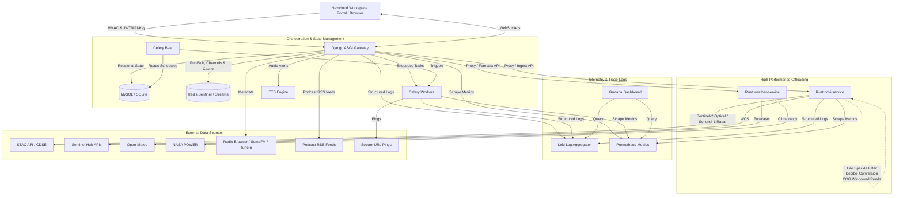

# Farm Intelligence Platform

Django + DRF service that provides authenticated APIs for user accounts, API key
lifecycle management, farm resources, activity scheduling, NDVI (Sentinel Hub)
retrieval, provider-backed weather data (Open-Meteo + NASA POWER), and public
radio metadata/stream discovery.

This repo uses both JWT (for user sessions and API key management) and
first-party API keys (`X-API-Key`) for service-to-service calls.

For project documentation, start with [docs/README.md](docs/README.md).

## Features

- Auth: register/login, token refresh, profile, password change/reset
  (`/api/v1/auth/`)
- API keys: create/list/revoke/rotate (JWT-only) (`/api/v1/keys/`)
- Farms: CRUD for user-owned farms (`/api/v1/farms/`)
- Activities: scheduled and event-triggered farm operations with scheduler lock, stale recovery, cleanup, health probe, and metrics ([README](activities/README.md), `/api/v1/activities/`)
- NDVI: timeseries/latest, raster retrieval and queueing, job status (`/api/v1/…/ndvi/`)
- Weather: current/daily/weekly with provider selection (`/api/v1/weather/…`)
- Farm weather: current/hourly/daily by farm id (`/api/v1/farms/<id>/weather/…`)
- Radio: station/provider metadata and stream URLs (`/api/v1/radio/…`)
- Podcasts: RSS-driven podcast catalogue and per-episode audio URLs (`/api/v1/podcasts/…`)
- Farm audio alerts: TTS-driven per-farm audio notifications (`/api/v1/alerts/…`)
- Caching: Redis (recommended/required in production) or local-memory cache
- Background jobs: Celery tasks for activities, NDVI refresh/backfill, and raster rendering
- Observability: Prometheus metrics via `django-prometheus` at `/metrics`

## Architecture



See [NDVI Pipeline Evolution](docs/architecture/ndvi-pipeline-evolution.md) for the planned Redis Sentinel + Streams rollout and operational checkpoints.

## Quickstart (local dev)

### Requirements

- Python: see `pyproject.toml` (project requires Python `>=3.12`)
- Recommended: a local Redis instance for cache and Celery broker/backends

### Setup

```bash
uv sync --no-install-project --group dev
```

All subsequent commands use `uv run` to avoid needing an explicit virtual environment activation.

### Environment

This project loads environment variables from a dotenv-style `.env` via
`django-environ` (see `config/settings.py`). Do not `source` `.env`; it is not
guaranteed to be shell-safe. For one-off scripts, use `django-environ` or
`python-dotenv` to load it.
An example file exists at `.env.example`.

See the app-level READMEs for the current feature surface:
- [Accounts](accounts/README.md)
- [API keys](api_keys/README.md)
- [Farms](farms/README.md)
- [Activities](activities/README.md)
- [NDVI](ndvi/README.md)
- [Weather](weather/README.md)
- [Radio](radio/README.md)
- [Podcasts](podcasts/README.md)
- [Alerts](alerts/README.md)
- [Monitoring](monitoring/README.md)

Minimum variables for local development:

```dotenv
DJANGO_SECRET_KEY=change-me
DJANGO_DEBUG=True
DJANGO_ALLOWED_HOSTS=127.0.0.1,localhost
```

Additional commonly-used variables (all optional unless noted):

```dotenv
# Deployment mode: development|ci|staging|production
DJANGO_ENV=development

# Database (defaults to local sqlite file if unset)
DATABASE_URL=sqlite:///db.sqlite3

# Cache (required when DJANGO_ENV=production; see config/settings.py)
REDIS_URL=redis://localhost:6379/0

# For Phase 1 deployments running Redis Sentinel, point `REDIS_URL` at a
# `redis-sentinel://` URI containing all sentinel endpoints, the `service_name`
# for the master, and the desired DB (e.g. `redis-sentinel://sentinel1:26379;
# sentinel2:26379/0?service_name=mymaster`). The settings code parses that URL to
# wire `django-redis` to `SentinelConnectionFactory` so caches always read from
# the elected master. Celery broker/result URLs should be updated alongside the
# rollout (see docs/architecture/ndvi-pipeline-evolution.md).

# API keys (required for staging/production; otherwise defaults to "dev-pepper")
DJANGO_API_KEY_PEPPER=long-random-string

# JWT lifetime settings
SIMPLE_JWT_ACCESS_MINUTES=15
SIMPLE_JWT_REFRESH_DAYS=7

# Password reset + email
FRONTEND_RESET_URL=https://frontend.example/reset
DEFAULT_FROM_EMAIL=no-reply@example.com
EMAIL_BACKEND=django.core.mail.backends.smtp.EmailBackend
EMAIL_HOST=localhost
EMAIL_PORT=25
EMAIL_HOST_USER=
EMAIL_HOST_PASSWORD=
EMAIL_USE_TLS=False
EMAIL_USE_SSL=False

# Throttling
API_KEY_THROTTLE_RATE=500/min
API_KEY_AUTH_LOG_SUCCESS=True
API_KEY_AUTH_CACHE_TTL_SECONDS=60
API_KEY_AUTH_CACHE_ALIAS=default

# Weather provider config
WEATHER_PROVIDER_DEFAULT=open_meteo
WEATHER_DEFAULT_TZ=Africa/Nairobi
OPEN_METEO_BASE_URL=https://api.open-meteo.com/v1/forecast
NASA_POWER_BASE_URL=https://power.larc.nasa.gov/api/temporal/daily/point
WEATHER_CACHE_TTL_CURRENT_S=120
WEATHER_CACHE_TTL_DAILY_S=900
WEATHER_CACHE_TTL_WEEKLY_S=1800
WEATHER_MAX_RANGE_DAYS=366

# NDVI config and limits (see config/settings.py for defaults)
NDVI_ENGINE=sentinelhub
NDVI_QUEUE_BACKEND=celery
NDVI_STREAM_NAME=ndvi:stream
NDVI_STREAM_GROUP=ndvi-group
NDVI_STREAM_CONSUMER=consumer_1
NDVI_STREAM_BLOCK_MS=5000
NDVI_STREAM_CLAIM_IDLE_MS=60000
NDVI_STREAM_MAXLEN=10000
NDVI_STREAM_DLQ_NAME=ndvi:dlq
NDVI_STREAM_DLQ_MAXLEN=10000
NDVI_STREAM_BATCH_SIZE=10
NDVI_STREAM_MAX_DELIVERIES=5
NDVI_STREAM_START_ID=0
NDVI_STREAM_RECLAIM_INTERVAL_SECONDS=60
NDVI_MAX_AREA_KM2=5000
NDVI_MAX_DATERANGE_DAYS=370
NDVI_LOCK_TIMEOUT_SECONDS=300
NDVI_CACHE_TTL_TIMESERIES_SECONDS=86400
NDVI_CACHE_TTL_LATEST_SECONDS=21600
NDVI_DEFAULT_STEP_DAYS=7
NDVI_DEFAULT_MAX_CLOUD=30
NDVI_DEFAULT_LOOKBACK_DAYS=14

# STAC engine settings
NDVI_STAC_API_URL=https://stac.dataspace.copernicus.eu/v1/
NDVI_STAC_COLLECTION=sentinel-2-l2a
NDVI_STAC_MAX_CLOUD_DEFAULT=30
NDVI_STAC_DATE_WINDOW_DAYS=3
NDVI_STAC_ASSET_RED=B04_10m
NDVI_STAC_ASSET_NIR=B08_10m
NDVI_STAC_TIMEOUT_SECS=30.0
NDVI_STAC_REQUEST_INTERVAL_SECS=10.0
NDVI_STAC_JITTER_MIN_SECS=1.0
NDVI_STAC_JITTER_MAX_SECS=5.0
NDVI_STAC_CIRCUIT_BREAKER_THRESHOLD=3
NDVI_STAC_CIRCUIT_BREAKER_TIMEOUT_SECS=300.0

# SentinelHub circuit breaker (applies to both metrics and raster engines)
NDVI_SENTINELHUB_CIRCUIT_BREAKER_THRESHOLD=3
NDVI_SENTINELHUB_CIRCUIT_BREAKER_TIMEOUT_SECS=300.0

# NDVI raster settings
NDVI_RASTER_ENGINE_PATH=ndvi.raster.sentinelhub_engine:SentinelHubRasterEngine
NDVI_RASTER_ENGINE_NAME=sentinelhub
NDVI_RASTER_MAX_SIZE=1024
NDVI_RASTER_DEFAULT_SIZE=256
NDVI_RASTER_MANUAL_QUEUE_COOLDOWN_SECONDS=60
NDVI_RASTER_CACHE_TTL_SECONDS=3600

# Farm state cache settings
FARM_STATE_CACHE_TTL_SECONDS=21600
FARM_STATE_LOCK_SECONDS=30
FARM_STATE_COVERAGE_TTL_SECONDS=21600
FARM_STATE_COVERAGE_LOCK_SECONDS=600
FARM_STATE_COVERAGE_THRESHOLD=0.3
FARM_STATE_TREND_WINDOW_DAYS=30
FARM_STATE_ESTABLISHMENT_MEAN_THRESHOLD=0.25
FARM_STATE_ESTABLISHMENT_MAX_THRESHOLD=0.4
FARM_STATE_FULL_CANOPY_MEAN_THRESHOLD=0.4

# NDVI manual refresh cooldown
NDVI_MANUAL_REFRESH_COOLDOWN_SECONDS=900
NDVI_REQUEST_TIMEOUT_SECONDS=20.0

# Rust microservice proxy (optional)
NDVI_SERVICE_URL=http://127.0.0.1:8081
NDVI_PROXY_ENABLED=True
WEATHER_SERVICE_URL=http://127.0.0.1:8090
# When enabled, Django forwards weather current/daily/weekly and farm hourly
# requests to the Rust weather service.
WEATHER_PROXY_ENABLED=True
PROXY_TIMEOUT_SECONDS=10

# Sentinel Hub credentials (required when using the Sentinel Hub engine)
SENTINELHUB_CLIENT_ID=...
SENTINELHUB_CLIENT_SECRET=...
SENTINELHUB_BASE_URL=https://services.sentinel-hub.com
```

Note: `.env.example` contains placeholders for additional providers. This repo’s
implemented weather providers are configured via `OPEN_METEO_BASE_URL`,
`NASA_POWER_BASE_URL`, and `WEATHER_*` settings (from code: `config/settings.py`).

### Run

```bash
uv run python manage.py migrate
uv run python manage.py runserver
```

Default timezone behavior:
- `TIME_ZONE` defaults to `Africa/Nairobi` with `USE_TZ=True` (UTC stored in DB).
- Celery uses `CELERY_TIMEZONE=Africa/Nairobi` with `CELERY_ENABLE_UTC=True`
  (from code: `config/settings.py`).

## Quickstart (Docker)

The root [Dockerfile](Dockerfile) is the standalone local-dev image. It
installs the Python dependencies, exposes port `8000`, and defaults to Django's
development server.

Build the image:

```bash
docker build -t farm-intelligence-platform-dev .
```

Run it with a local `.env` file:

Start from [`.env.example`](.env.example) and fill in the required values.

```bash
docker run --rm -it \
  --env-file .env \
  -p 8000:8000 \
  -v "$(pwd):/app" \
  farm-intelligence-platform-dev
```

The standalone container works with the repo's SQLite default if
`DATABASE_URL` is unset.

Useful overrides:

```bash
docker run --rm -it --env-file .env farm-intelligence-platform-dev \
  python manage.py migrate

docker run --rm -it --env-file .env farm-intelligence-platform-dev \
  celery -A config worker -l info
```

For the full local stack, use the root [docker-compose.yml](docker-compose.yml):

Start from [`.env.compose.example`](.env.compose.example) for compose-specific
defaults, then copy it to `.env` and adjust any secrets or host values.

```bash
make up
```

That brings up:

- `web` on `http://localhost:8000`
- `db` (MySQL)
- `redis`

The compose file runs `python manage.py migrate --noinput` in a one-shot
`migrate` service before the web and Celery services start.

`worker` and `beat` are optional profiles:

```bash
make up-full
```

Use the second command when you want the full local stack with Celery worker
and beat enabled.

The `web` service includes a healthcheck that probes `http://127.0.0.1:8000/`
inside the container.

Useful compose commands:

```bash
make logs
make createsuperuser
make down
```

The repository also includes a monitoring stack compose file for Prometheus and
Grafana:

```bash
docker compose -f docker-compose.monitoring.yml up -d
```

Prometheus and Grafana will be available at:
- Prometheus: `http://localhost:9090`
- Grafana: `http://localhost:3000`

Prometheus is configured to scrape `host.docker.internal:8000/metrics`
(from code: `prometheus.yml`).

### Celery (local processes)

Celery configuration lives in `config/celery.py` and reads settings keys
prefixed with `CELERY_` (from code: `config/celery.py`).

Example commands:

```bash
uv run celery -A config worker -l info
uv run celery -A config beat -l info
```

If you run workers in a separate process, set a real broker URL (e.g., via
`REDIS_URL` or `CELERY_BROKER_URL`); the default `memory://` broker is
process-local (from code: `config/settings.py`).

## API docs

- OpenAPI schema: `/api/schema/`
- Swagger UI: `/api/docs/`
- ReDoc: `/api/redoc/`

Response conventions (from code: `config/api/responses.py`):
- Many APIViews return a success envelope via `success_response`.
- Some ViewSets (e.g., farms) return standard DRF serializer JSON (from code:
  `farms/views.py`).

## Reverse proxy

Serve the API behind a TLS-terminating reverse proxy and keep the `/api/v1/`
paths stable. Reverse proxy headers, Django proxy-awareness settings, Nextcloud
notes, and schema/docs blocking guidance live in
`docs/reverse-proxy.md`.

## Verification

Example curl checks through the public proxy URL (confirm status and
`Content-Type: application/json`):

```bash
curl -sS -D - -o /dev/null https://api.example.com/api/v1/integrations/ping/
curl -sS -D - -o /dev/null \
  -H "X-API-Key: <api-key>" \
  https://api.example.com/api/v1/integrations/ping/
```

Checklist:
- [ ] backend reachable
- [ ] auth required where expected
- [ ] `/api/v1/` endpoints respond through proxy

Legacy aliases under `/api/v1/integration/` remain available but are
deprecated.

## Authentication

Global DRF auth includes:

- JWT: `Authorization: Bearer <access>`
- API key: `X-API-Key: <plaintext>`

Not all endpoints accept both:
- `/api/v1/keys/` is JWT-only by design (from code: `api_keys/views.py`).

### Nextcloud Integration Security (HMAC)

This repo supports Nextcloud → `farm-intelligence-platform` server-to-server calls protected
by an *additional* HMAC signing layer (request integrity + replay resistance).
It does not replace JWT or API keys; it composes with them for endpoints that
also require a user identity.

Ping endpoint (HMAC-only, no JWT/API key):
- GET `/api/v1/integrations/nextcloud/ping/`

#### Integration clients (admin-only)

Legacy admin endpoints (JWT + `IsAdminUser`) for IntegrationClient metadata:
- POST `/api/v1/integrations/clients/` → creates a client and returns the secret once
- POST `/api/v1/integrations/clients/{id}/rotate-secret/` → rotates and returns the new secret once
- GET/PATCH `/api/v1/integrations/clients/{id}/` → no secret fields are ever returned

HMAC verification uses `INTEGRATION_HMAC_CLIENTS_JSON` as the source of truth.
Rotate by updating `INTEGRATION_HMAC_CLIENTS_JSON` and Nextcloud config, keeping
the old entry during cutover.

Required headers:
- `X-Client-Id` (preferred) or `X-NC-CLIENT-ID` (deprecated alias)
- `X-NC-TIMESTAMP` (unix seconds)
- `X-NC-NONCE` (unique per request)
- `X-NC-SIGNATURE` (hex HMAC-SHA256 of the canonical string)

Canonical string (newline-separated):
`METHOD\nPATH\nCANONICAL_QUERY\nTIMESTAMP\nNONCE\nBODY_SHA256`

Environment variables (from code: `config/settings.py`):
- `NEXTCLOUD_HMAC_ENABLED` (default `True`)
- `NEXTCLOUD_HMAC_MAX_SKEW_SECONDS` (default `300`)
- `NEXTCLOUD_HMAC_NONCE_TTL_SECONDS` (default `360`)
- `NEXTCLOUD_HMAC_CACHE_ALIAS` (default `default`)
- `INTEGRATION_HMAC_CLIENTS_JSON` (JSON map of `client_id -> secret_b64`)
- `INTEGRATION_LEGACY_CONFIG_ALLOWED` (default `False`)

Full contract, examples, and guidance for endpoint protection (v1/v2) live in
`docs/security/nextcloud-hmac.md`.

Minimal local signing example (placeholders only):

```bash
python - <<'PY'
import base64, hashlib, hmac

secret = base64.b64decode("<base64-secret>")
method = "GET"
path = "/api/v1/integrations/nextcloud/ping/"
canonical_query = ""
timestamp = 1700000000
nonce = "<uuid>"
body_sha256 = hashlib.sha256(b"").hexdigest()

canonical = "\n".join([method, path, canonical_query, str(timestamp), nonce, body_sha256])
print(hmac.new(secret, canonical.encode(), hashlib.sha256).hexdigest())
PY
```

```bash
curl -sS "http://localhost:8000/api/v1/integrations/nextcloud/ping/" \
  -H "X-Client-Id: <client-uuid>" \
  -H "X-NC-TIMESTAMP: 1700000000" \
  -H "X-NC-NONCE: <uuid>" \
  -H "X-NC-SIGNATURE: <hex>"
```

### Integration Security

- HMAC spec: [docs/security/nextcloud-hmac.md](docs/security/nextcloud-hmac.md)
- HMAC audit: [docs/hmac_audit.md](docs/hmac_audit.md)
- HMAC clean setup: [docs/hmac_clean_setup.md](docs/hmac_clean_setup.md)
- Operational runbook: [docs/security/nextcloud-hmac-runbook.md](docs/security/nextcloud-hmac-runbook.md)
- Password reset: [docs/accounts/password-reset.md](docs/accounts/password-reset.md)

## Observability

- Metrics endpoint: `/metrics` (from code: `config/urls.py` includes
  `django_prometheus.urls` at the root).
- Prometheus scrape config: `prometheus.yml`
- Example monitoring stack: `docker-compose.monitoring.yml`

## Monitoring

Runbook: [docs/monitoring.md](docs/monitoring.md).

- Grafana dashboard: `monitoring/grafana/dashboards/farm-intelligence-platform-observability.json`
- Prometheus + Grafana + Loki stack: `docker-compose.monitoring.yml`

## Testing & quality gates

Repo tooling is configured in `pyproject.toml` and `.pre-commit-config.yaml`.
Type checking is enforced in pre-commit and CI via the same mypy invocation.

```bash
uv run pre-commit run --all-files
uv run pytest
uv run ruff format .
uv run ruff check .
uv run ./scripts/typecheck.sh
uv run bandit -c pyproject.toml -r .
```

## Contributing and security

- [Contributing guide](CONTRIBUTING.md)
- [Security policy](SECURITY.md)
- [Code of conduct](CODE_OF_CONDUCT.md)
- [Changelog](CHANGELOG.md)

## Security notes

- Secrets and credentials must come from environment variables; do not commit
  secrets into the repo.
- API keys are stored hashed (peppered with `DJANGO_API_KEY_PEPPER`) and only
  returned once at creation/rotation time (from code: `api_keys/auth.py`,
  `api_keys/serializers.py`).
- Throttling is enabled via DRF throttle classes and rates in
  `config/settings.py`.

## Repo structure

- `accounts/`: user authentication and profile endpoints ([README](accounts/README.md))
- `api_keys/`: API key model + authentication + JWT-only lifecycle endpoints ([README](api_keys/README.md))
- `farms/`: user-owned farm resources ([README](farms/README.md))
- `activities/`: activity scheduling, execution, and NDVI-trigger handlers ([README](activities/README.md), [architecture](docs/architecture/activities/README.md))
- `ndvi/`: NDVI retrieval (Sentinel Hub) + Celery tasks + raster support ([README](ndvi/README.md), [engine guide](docs/contributing_ndvi_engines.md))
- `weather/`: provider-swappable weather subsystem (Open-Meteo + NASA POWER) ([README](weather/README.md), [engine guide](docs/contributing_weather_engines.md))
- `config/`: Django settings/urls/celery wiring
- `docs/`: architecture, status, runbooks, and audit notes for implemented subsystems
