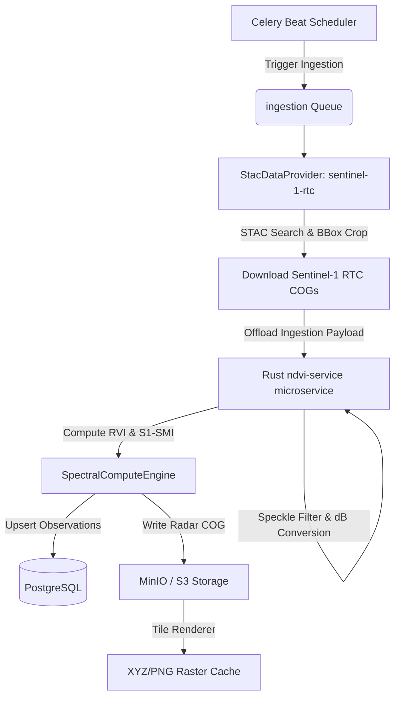

# Sentinel-1 Radar Integration — System Design Architecture

**Document:** docs/agritech/sentinel1/01-architecture.md  
**Status:** Approved / Architecture Design  
**Author:** Principal Platform Engineering & Crop Science  
**Target Phase:** Phase 4 (Scale Extension) / Optional Phase 5  

---

## 1. Executive Summary

Optical satellite analytics (Sentinel-2, Landsat-8) are the backbone of the Farm Intelligence Platform but suffer from a fatal flaw: **cloud cover**. In tropical regions (e.g., Gatundu, Kenya), seasonal monsoons and constant cloud cover can create data blackouts lasting up to 45 consecutive days.

This architecture document outlines the integration of **Sentinel-1 C-band Synthetic Aperture Radar (SAR)**. By combining all-weather radar observations with existing optical indices (NDVI, NDWI, NDMI), the platform will deliver:
1. **Zero-gap temporal continuity:** Cloud-penetrating observations every 6–12 days.
2. **True surface soil moisture measurements:** Using co-polarized (VV) radar backscatter.
3. **Advanced crop structure modeling:** Utilizing cross-polarized (VH) ratios to calculate the Radar Vegetation Index (RVI), which is immune to the canopy saturation that plagues optical NDVI.

---

## 2. Scientific Foundations of Sentinel-1 (C-Band SAR)

### 2.1 Polarizations & Backscatter Semantics
Sentinel-1 emits microwave pulses and measures the backscatter (reflected signal) in two dual-polarizations:
* **VV (Vertical-transmit, Vertical-receive):** Strongly responsive to surface roughness and soil dielectric constant (directly proportional to **surface soil moisture**).
* **VH (Vertical-transmit, Horizontal-receive):** Undergoes volume scattering when it interacts with the complex geometry of vegetation (leaves, stems, stalks). It is a direct indicator of **crop biomass and canopy structure**.

### 2.2 Core Radar Indices to Integrate

#### A. Radar Vegetation Index (RVI)
Measures the structural complexity and growth stage of the canopy:
$$RVI = \frac{4 \cdot VH}{VV + VH}$$
* **Range:** `0.0` (bare soil) to `1.0` (dense, random forest canopy).
* **Crop Stages:** Ideal for monitoring crop development and identifying lodging (crops falling over).

#### B. Sentinel-1 Soil Moisture Index (S1-SMI)
Normalized index designed to estimate soil water content underneath vegetation by compensating for canopy attenuation:
$$S1\text{-}SMI = \alpha \cdot VV_{dB} + \beta \cdot VH_{dB} + \gamma$$
* Utilizes VV to capture soil dielectric changes and VH (integrated into the formula weights $\alpha, \beta, \gamma$ calibrated per crop type) to subtract backscatter attenuation caused by the crop canopy.
* **Range:** `0.0` (dry soil) to `1.0` (saturated soil capacity).

---

## 3. System Architecture & Data Flow

Because of the **Phase 1 generic spectral engine refactor**, Sentinel-1 will be ingested as a standard sensor collection. It will reuse the existing `SpectralComputeEngine` and pipeline layout.



### 3.1 Pre-processing Offloaded to Rust
To keep Django Celery workers thin, fast, and prevent memory spikes, **all heavy pre-processing is offloaded to the Rust `ndvi-service` microservice**:
1. **Linear-to-Decibel Conversion:** Convert backscatter intensity values to decibels:
   $$dB = 10 \cdot \log_{10}(value)$$
2. **Speckle Filtering:** Execute a 3x3 or 5x5 Refined Lee filter in Rust to smooth out radar speckle noise before computing statistics.
3. **RVI & S1-SMI Calculation:** Compute the radar formulas over the cropped matrix slices in Rust, passing the final computed stats back to Django.

---

## 4. Code & Configuration Schemas

No code changes are required in the core engines. The integration is performed entirely through the declarative registries.

### 4.1 Band Registry Integration
Add mappings in [science/formulas/band_registry.py](file:///home/rahim/projects/Farm-Intelligence-Platform/science/formulas/band_registry.py):

```python
# Add to BAND_REGISTRY in science/formulas/band_registry.py
BAND_REGISTRY["sentinel1_rtc"] = {
    "vv": "vv",
    "vh": "vh",
}
```

### 4.2 Formula Registry Integration
Add the radar-based calculations in [science/formulas/registry.py](file:///home/rahim/projects/Farm-Intelligence-Platform/science/formulas/registry.py):

```python
# Add to FORMULA_REGISTRY in science/formulas/registry.py
FORMULA_REGISTRY["RVI"] = {
    "name": "RVI",
    "formula": lambda vv, vh: (4 * vh) / (vv + vh),
    "bands": ["vv", "vh"],
    "range": (0.0, 1.0),
    "default_colormap": "YlGn",
    "default_min": 0.0,
    "default_max": 0.8,
    "sensor_band_map": {
        "sentinel1_rtc": {"vv": "vv", "vh": "vh"},
    },
    "description": "Radar Vegetation Index for canopy structure monitoring.",
}

FORMULA_REGISTRY["S1_SMI"] = {
    "name": "S1_SMI",
    "formula": lambda vv, vh: 0.7 * vv - 0.3 * vh + 0.5, # Calibrated baseline weights
    "bands": ["vv", "vh"],
    "range": (0.0, 1.0),
    "default_colormap": "Blues",
    "default_min": 0.0,
    "default_max": 1.0,
    "sensor_band_map": {
        "sentinel1_rtc": {"vv": "vv", "vh": "vh"},
    },
    "description": "Sentinel-1 Surface Soil Moisture Index.",
}
```

### 4.3 Database Migration Settings
To allow the database to accept RVI and S1-SMI data, modify the model options:

```diff
# ndvi/models.py
class NdviObservation(models.Model):
    INDEX_CHOICES = [
        ("NDVI", "NDVI"),
        ("NDWI", "NDWI"),
        ("NDMI", "NDMI"),
+       ("RVI", "Radar Vegetation Index"),
+       ("S1_SMI", "Sentinel-1 Soil Moisture Index"),
    ]
```

---

## 5. UI Presentation & Fallback Strategy

At launch, **optical indices (NDVI/NDMI) and radar indices (RVI/S1-SMI) will be presented as independent, parallel data series** on the user dashboard:
* **The Dashboard Layout:** Separate cards/charts for "Crop Biomass (NDVI vs. RVI)" and "Moisture Status (NDMI vs. S1-SMI)". This lets users compare optical and radar readings side-by-side to understand ground reality.
* **Future Evolution:** In later phases, after gathering sufficient ground-truth calibration data, we will introduce a blended temporal fusion curve.

---

## 6. Implementation Checklist (Definition of Done)

- [ ] **Data Model:** Generate Django database migrations for the `"RVI"` and `"S1_SMI"` model choices.
- [ ] **Provider Configuration:** Register `sentinel-1-rtc` in settings and environment.
- [ ] **Rust Integration:** Implement Refined Lee speckle filter and dB calculation in `ndvi-service`.
- [ ] **Registries:** Wire `sentinel1_rtc` into `band_registry` and `formula_registry`.
- [ ] **Schedules:** Define `enqueue_daily_rvi_refresh` beat task in `config/settings.py`.
- [ ] **Nextcloud UI:** Synchronize schema to automatically generate RVI & S1-SMI graphs and maps on the user dashboard.
