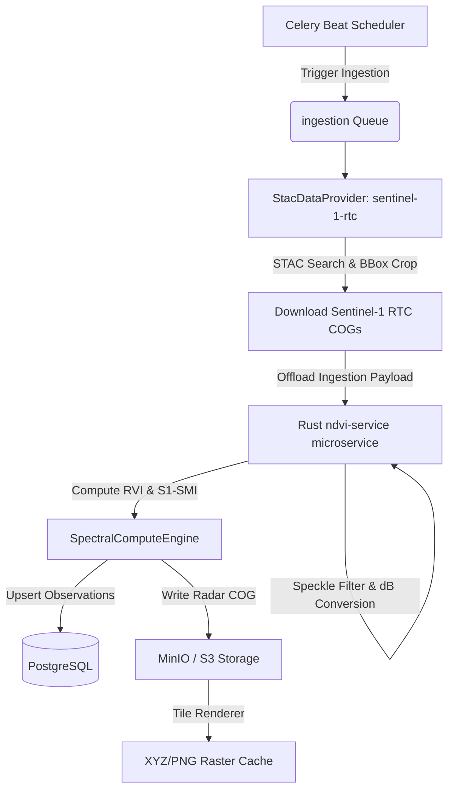

# Sentinel-1 Radar Integration — System Design Architecture

**Document:** docs/agritech/sentinel1/01-architecture.md  
**Status:** Approved / Architecture Design  
**Author:** Principal Platform Engineering & Crop Science  
**Target Phase:** Phase 4 (Scale Extension) / Optional Phase 5  

---

## 1. Executive Summary

Optical satellite analytics (Sentinel-2, Landsat-8) are the backbone of the Farm Intelligence Platform but suffer from a fatal flaw: **cloud cover**. In tropical regions (e.g., Gatundu, Kenya), seasonal monsoons and constant cloud cover can create data blackouts lasting up to 45 consecutive days.

This architecture document outlines the integration of **Sentinel-1 C-band Synthetic Aperture Radar (SAR)** to complement optical data streams. By combining all-weather radar observations with existing optical indices (NDVI, NDWI, NDMI), the platform will deliver:
1. **Zero-gap temporal continuity:** Cloud-penetrating observations every 6–12 days.
2. **Radar-derived soil moisture estimation:** Physically based estimates of near-surface soil moisture derived from radar backscatter.
3. **Advanced crop structure modeling:** Utilizing cross-polarized (VH) ratios to calculate the Radar Vegetation Index (RVI), which is immune to the canopy saturation that plagues optical NDVI.

---

## 2. Scientific Foundations & Target Semantics

### 2.1 Backscatter Coefficients as Soil Moisture Proxies
A critical scientific distinction must be maintained: **Sentinel-1 does not directly measure soil moisture.** Instead, the sensor measures the radar backscatter coefficient ($\sigma^0$) in decibels. 

Backscatter is directly influenced by the target's **dielectric constant**, which is dominated by water content. Hence, the platform treats radar backscatter as a **physical proxy or estimate** of near-surface soil moisture, rather than a direct volumetric measurement. 
* **VV (Vertical-transmit, Vertical-receive) polarization:** Highly responsive to surface soil dielectric changes and soil surface roughness.
* **VH (Vertical-transmit, Horizontal-receive) polarization:** Undergoes volume scattering as it interacts with the complex geometry of vegetation (leaves, stems, stalks), indicating canopy biomass and structure.

### 2.2 Core Radar Indices to Integrate

#### A. Radar Vegetation Index (RVI)
Measures the structural complexity and growth stage of the canopy:
$$RVI = \frac{4 \cdot VH}{VV + VH}$$
* **Range:** `0.0` (bare soil) to `1.0` (dense, random forest canopy).
* **Crop Stages:** Ideal for monitoring crop development and identifying lodging (crops falling over).

#### B. Sentinel-1 Soil Moisture Index (S1-SMI)
S1-SMI is a **configurable empirical retrieval model** rather than a universal scientific equation. It is formulated as a parametric regression model to estimate surface soil moisture underneath vegetation by compensating for canopy attenuation:
$$S1\text{-}SMI = \alpha \cdot VV_{dB} + \beta \cdot VH_{dB} + \gamma$$

* **Calibration Dependency:** The coefficients ($\alpha, \beta, \gamma$) are site-specific and depend heavily on:
  * **Crop Type:** Different canopy architectures attenuate the radar signal uniquely.
  * **Incidence Angle:** The local look geometry of the satellite path relative to the terrain.
  * **Local Soil Properties:** Soil texture, bulk density, and organic carbon content, which determine the base dielectric range.
  * **Regional Ground-Truth Datasets:** Local calibration data is required to map backscatter to actual soil moisture percentages.

---

## 3. System Architecture & Data Flow

Because of the **Phase 1 generic spectral engine refactor**, Sentinel-1 will be ingested as a standard sensor collection. It will reuse the existing `SpectralComputeEngine` and pipeline layout.



### 3.1 Pre-processing Offloaded to Rust
To keep Django Celery workers thin, fast, and prevent memory spikes, **all heavy pre-processing is offloaded to the Rust `ndvi-service` microservice**:
1. **Linear-to-Decibel Conversion:** Convert backscatter intensity values to decibels:
   $$dB = 10 \cdot \log_{10}(value)$$
2. **Speckle Filtering:** Execute a 3x3 or 5x5 Refined Lee filter in Rust to smooth out radar speckle noise before computing statistics.
3. **RVI & S1-SMI Calculation:** Compute the radar formulas over the cropped matrix slices in Rust, passing the final computed stats back to Django.

---

## 4. Preprocessing Assumptions & Pipeline

The system assumes the use of **Sentinel-1 Radiometric Terrain Corrected (RTC)** data products. The preprocessing pipeline is split clearly between upstream providers and internal microservice steps to optimize efficiency:

| Pipeline Step | Handled By | Description |
| :--- | :---: | :--- |
| **Radiometric Terrain Correction (RTC)** | **Upstream Provider** *(CDSE / MPC)* | Corrects geometric distortions (layover, foreshortening, shadow) and terrain-induced backscatter variation using a DEM. |
| **Thermal-Noise Removal** | **Upstream Provider** *(CDSE / MPC)* | Subtracts background instrument noise, particularly critical for low-signal cross-polarized (VH) channels. |
| **Border-Noise Removal** | **Upstream Provider** | Masks out invalid edge pixels at the start and end of the radar swaths. |
| **Border Cropping & Spatial subsetting** | **Rust Microservice** | Crops the large 500MB+ scene down to the farm's bounding box coordinates. |
| **Decibel (dB) Conversion** | **Rust Microservice** | Converts linear amplitude values to decibels ($dB = 10 \log_{10}(intensity)$). |
| **Incidence-Angle Normalization** | **Rust Microservice** | Normalizes backscatter to a reference incidence angle (e.g., 40°) using a cosine correction model to ensure comparability across different orbits. |
| **Speckle Filtering** | **Rust Microservice** | Applies a Refined Lee filter to suppress coherent speckle noise in the cropped farm subset. |
| **Orbit Consistency Separation** | **Rust Microservice** | Flags and stores Ascending vs. Descending orbits as distinct tracks. |

---

## 5. Orbit Consistency Guidance

Temporal analysis of radar backscatter is highly sensitive to orbit geometry. **The platform must strictly avoid mixing ascending and descending passes directly in the same time-series trend unless they are normalized.**

### 5.1 Why Orbit Geometry Influences Backscatter
* **Look Direction and Topography:** Ascending orbits look Eastward (from a northbound flight path), while Descending orbits look Westward (from a southbound flight path). In hilly terrains like Gatundu, slopes facing the radar will show high backscatter (foreshortening), while slopes facing away will show low backscatter.
* **Diurnal Variations (Morning vs. Evening):** 
  * Descending passes over Kenya occur in the **morning (~06:00 local time)**. They often capture heavy **morning dew** on crop leaves and high soil surface moisture before diurnal transpiration begins. This presence of free liquid water spikes the dielectric constant, leading to artificially elevated backscatter.
  * Ascending passes occur in the **evening (~18:00 local time)**, capturing canopy conditions after a full day of transpiration and solar drying.

---

## 6. Rust Preprocessing Engine & Numerical Stability

To ensure high-performance, memory-efficient processing of Sentinel-1 rasters, the Rust `ndvi-service` utilizes the following engineering patterns:

### 6.1 Memory-Efficient Raster Streaming & Windowed Reading
* **Cloud-Optimized GeoTIFF (COG) Windowed Reading:** The Rust service uses GDAL or `tiff` crates to perform **HTTP range requests**, downloading only the specific bounding box pixels needed for the farm's geometry, avoiding downloading the entire 500MB scene.
* **Tiled Processing:** For larger areas, the raster is read and processed in smaller, spatial tiles (e.g., 256x256 blocks) to maintain a constant, low memory footprint.

### 6.2 Parallelization & Acceleration
* **Rayon Multithreading:** Speckle filtering (the Refined Lee kernel convolution) is parallelized across available CPU threads using the Rayon library.
* **SIMD Optimizations:** Utilizing SIMD (Single Instruction, Multiple Data) compiler features (or auto-vectorization) to compute the decibel logarithmic conversion and convolution kernels at the hardware assembly level.

### 6.3 Numerical Stability Safeguards
* **NoData Handling:** Standard Sentinel-1 NoData border pixels (typically `0` or explicit metadata masks) are explicitly detected and converted to `NaN` masks, excluding them from mean and variance calculations.
* **Divide-by-Zero Protection:** In RVI calculation, if the denominator ($VV + VH$) is equal to `0` (or extremely close to zero, e.g., $< 1e\text{-}6$), the pixel is masked out as `NaN` to prevent division-by-zero panics.
* **Clamping decibel values:** Decibel values are clamped to a safe operational range (e.g., `-30.0 dB` to `0.0 dB`) to prevent log-math exceptions on noise floor values.
* **NaN Propagation Policy:** The system uses a strict "Mask and Exclude" NaN policy. During spatial statistics rollup, `NaN` pixels are ignored (equivalent to `np.nanmean`), and the `valid_pixel_fraction` is adjusted down. If `valid_pixel_fraction` drops below `0.70`, the entire observation is marked as invalid.

---

## 7. Decoupled Calibration Registry Architecture

To prevent code changes in the compute engine when calibration coefficients are tuned, the coefficients ($\alpha, \beta, \gamma$) are separated into a YAML configuration file.

### 7.1 Calibration Configuration Schema (`science/thresholds/s1_smi_calibration.yaml`)
```yaml
# science/thresholds/s1_smi_calibration.yaml
s1_smi_coefficients:
  maize:
    sandy_clay_loam:
      ascending:  { alpha: 0.72, beta: -0.28, gamma: 0.45 }
      descending: { alpha: 0.68, beta: -0.32, gamma: 0.52 }
  wheat:
    loam:
      ascending:  { alpha: 0.81, beta: -0.19, gamma: 0.38 }
      descending: { alpha: 0.75, beta: -0.25, gamma: 0.42 }
  default:
    ascending:  { alpha: 0.70, beta: -0.30, gamma: 0.50 }
    descending: { alpha: 0.70, beta: -0.30, gamma: 0.50 }
```

### 7.2 Registry Integration
Add mappings in [science/formulas/band_registry.py](file:///home/rahim/projects/Farm-Intelligence-Platform/science/formulas/band_registry.py):
```python
BAND_REGISTRY["sentinel1_rtc"] = {
    "vv": "vv",
    "vh": "vh",
}
```

Add the radar-based calculations in [science/formulas/registry.py](file:///home/rahim/projects/Farm-Intelligence-Platform/science/formulas/registry.py):
```python
FORMULA_REGISTRY["RVI"] = {
    "name": "RVI",
    "formula": lambda vv, vh: (4 * vh) / (vv + vh),
    "bands": ["vv", "vh"],
    "range": (0.0, 1.0),
    "default_colormap": "YlGn",
    "default_min": 0.0,
    "default_max": 0.8,
    "sensor_band_map": {
        "sentinel1_rtc": {"vv": "vv", "vh": "vh"},
    },
    "description": "Radar Vegetation Index for canopy structure monitoring.",
}

# The formula retrieves dynamic coefficients loaded at runtime based on farm metadata
FORMULA_REGISTRY["S1_SMI"] = {
    "name": "S1_SMI",
    "formula": lambda vv, vh, alpha=0.70, beta=-0.30, gamma=0.50: alpha * vv + beta * vh + gamma,
    "bands": ["vv", "vh"],
    "range": (0.0, 1.0),
    "default_colormap": "Blues",
    "default_min": 0.0,
    "default_max": 1.0,
    "sensor_band_map": {
        "sentinel1_rtc": {"vv": "vv", "vh": "vh"},
    },
    "description": "Sentinel-1 Soil Moisture Index (estimated surface soil moisture).",
}
```

And update the DB model choices in `ndvi/models.py`:
```python
class NdviObservation(models.Model):
    INDEX_CHOICES = [
        ("NDVI", "NDVI"),
        ("NDWI", "NDWI"),
        ("NDMI", "NDMI"),
        ("RVI", "Radar Vegetation Index"),
        ("S1_SMI", "Sentinel-1 Soil Moisture Index"),
    ]
```

---

## 8. Performance & Scale Expectations

To ensure system reliability under operational load, the following target performance thresholds are established for the Sentinel-1 pipeline:

* **Ingestion Throughput:** Supporting $\ge 100$ farm ingestion request dispatches per minute during peak satellite overpass windows.
* **Preprocessing Latency:** Total execution time of $\le 500$ milliseconds per farm bounding box subset for the entire Rust pipeline (from S3 streaming crop to speckle filter output).
* **Rust Memory Usage:** Heap memory allocation constrained to $\le 64$ MB per execution thread (ensured via tiled processing loops and windowed COG range readings).
* **Raster Processing Concurrency:** Support for at least 8 parallel processing worker threads per running microservice container.
* **PostgreSQL Write Batching:** DB observation inserts executed in bulk chunks of 100+ items to reduce transactional load and connection hold times.
* **Cache Sizing & TTL:**
  * **L2 Cache (Redis):** Target hit ratio of $\ge 80\%$ (15-minute TTL).
  * **L3 Cache (MinIO/S3):** Target hit ratio of $\ge 95\%$ for computed COG rasters.

---

## 9. Future Architecture Roadmap

The implementation and integration of the agricultural sensor indices follow a structured 6-phase rollout:

* **Phase 1: Optical Indices**
  * Establish baseline NDVI, NDWI, and NDMI calculations from Sentinel-2 and Landsat.
* **Phase 2: Parallel Radar Indices**
  * Ingest Sentinel-1 RTC products and compute RVI and S1-SMI, keeping radar and optical data separate.
* **Phase 3: Temporal Gap Filling**
  * Use the radar time series to fill gaps in the timeline when optical sensors are blinded by cloud cover.
* **Phase 4: Optical/Radar Fusion**
  * Build a blended, calibrated single-curve estimation model combining structural (optical) and volumetric (radar) components.
* **Phase 5: Machine-Learning Crop Health Models**
  * Train and deploy ML models using fused S1/S2 features for predictive yield estimation and crop classification.
* **Phase 6: Multi-Sensor Fusion**
  * Implement fully integrated model-data fusion (Sentinel-2, Sentinel-1, Landsat, Planet, local weather, and high-resolution DEM elevations).

---

## 10. Validation & Calibration Strategy

Radar indices **complement, not replace**, optical products. They measure different physical properties. The validation and calibration of S1-SMI and RVI are conducted through the following channels:

1. **In-situ Soil Moisture Probes (When Available):** Directly comparing depth-specific soil moisture measurements (at 5cm, 10cm, 20cm) against S1-SMI output to calibrate the local linear coefficients ($\alpha, \beta, \gamma$).
2. **Weather Station Precipitation Correlation:** Cross-correlating local precipitation events (from Open-Meteo or NASA POWER) with sudden spikes in the S1-SMI backscatter proxy.
3. **Cross-Sensor Optical Correlation:** Correlating RVI with NDVI (canopy structure) and S1-SMI with NDMI (canopy moisture) during clear-sky days to ensure physical alignment.
4. **Historical Baseline Anomaly Isolation:** Building multi-year seasonal baselines of RVI and S1-SMI to isolate structural crop anomalies from natural climate variations.

---

## 11. Error Handling & Resiliency

To prevent pipeline failures, the Sentinel-1 compute pipeline defines strict error boundaries:

| Failure Scenario | Action / Remediation | System State |
| :--- | :--- | :--- |
| **Missing VV or VH bands** | Log warning `stac.polarization_incomplete`, abort RVI/S SMI calculation for that scene, continue with other indices. | Graceful degradation (Missing data point) |
| **Incomplete STAC metadata** | If orbit direction (ascending/descending) metadata is missing, assume descending as default, log a warning `stac.metadata_missing`. | Graceful degradation |
| **Raster window failure** | Catch CRS transformation exceptions, fallback to checking boundary intersections. If farm lies outside swath, mark `valid_pixel_fraction = 0.0` and skip. | Skip / Log Warning |
| **Corrupt COG encountered** | Capture GDAL/network exceptions, trigger a retry with exponential backoff. After 3 retries, push job to **Dead Letter Queue (DLQ)**. | Retry / Queue in DLQ |
| **Formula out-of-range output** | Clip RVI output to `[0.0, 1.0]` and S1-SMI to `[0.0, 1.0]`. If $> 5\%$ of pixels require clipping, flag observation as `state = "WARNING"`. | Flagged Save |

---

## 12. UI Presentation & Fallback Strategy

At launch, **optical indices (NDVI/NDMI) and radar indices (RVI/S1-SMI) will be presented as independent, parallel data series** on the user dashboard:
* **The Dashboard Layout:** Separate cards/charts for "Crop Biomass (NDVI vs. RVI)" and "Moisture Status (NDMI vs. S1-SMI)". This lets users compare optical and radar readings side-by-side to understand ground reality.
* **Future Evolution:** In later phases, after gathering sufficient ground-truth calibration data, we will introduce a blended temporal fusion curve.
