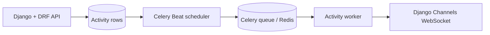

# Activity Scheduling Architecture

This directory contains the technical design and implementation documentation for the Activities app.

## Document Index

| # | Document | Description |
|---|----------|-------------|
| 01 | [Technical Design Document](./01_technical_design.md) | Original design and implementation blueprint |
| 02 | [Production Hardening Review](./02_hardening_review.md) | Concurrency, reliability, and operational hardening review |

## Architecture Overview

The Activities subsystem is an event-driven engine for managing:

- Vaccinations
- Fertilizer re-application
- Irrigation
- NDVI-triggered farm operations

### System Flow

## Key Components

| Component | File Reference |
|-----------|---------------|
| TDD | `01_technical_design.md` |
| Hardening Review | `02_hardening_review.md` |
| CRUD API | `activities/views.py` |
| Scheduler + worker tasks | `activities/tasks.py` |
| Handlers | `activities/handlers/` |
| WebSocket notifications | `activities/consumers.py` |

## Quick Links

- [Technical Design Document](./01_technical_design.md)
- [Hardening Review](./02_hardening_review.md)
- [Activities app README](../../../activities/README.md)
- [NDVI integration status](../../status/ACTIVITIES_NDVI_INTEGRATION_STATUS.md)

## Document Relationship

The TDD describes the full implementation model, while the hardening review records the race-condition, timeout, and operational fixes that were needed to make the subsystem safe for production use.

## Implementation Phases

| Phase | Focus | Status | Document / Code |
|-------|-------|--------|-----------------|
| Phase 1 | Core API | ✅ IMPLEMENTED | TDD Section 9 + `activities/views.py` |
| Phase 2 | Scheduler + service layer | ✅ IMPLEMENTED | TDD Sections 4-6 + `activities/services.py` |
| Phase 3 | Worker + WebSocket + handlers | ✅ IMPLEMENTED | TDD Section 8 + `activities/tasks.py` + `activities/handlers/` |
| Phase 4 | NDVI integration | ✅ IMPLEMENTED | TDD Section 13 + `activities/handlers/ndvi_trigger.py` |
| Phase 5 | Production hardening | 🟡 Partial | Hardening review; circuit breaker ✅, dead letter ❌, load testing ❌ |

## Current Implementation Notes

- `Activity` is the source of truth for status and scheduling state.
- `activities.scheduler.poll` claims due activities and dispatches worker execution.
- `activities.execute` validates the execution ID, runs the handler, and persists terminal state.
- `activities.recover_stale` resets stuck work.
- `NdviTriggerHandler` returns recommended follow-up actions instead of creating new activities directly.
- WebSocket delivery is best-effort; the REST API remains authoritative.

## Hardening Review Alignment

| Issue | Status | Implementation |
|-------|--------|----------------|
| Split-brain locking | ✅ Fixed | Atomic claim via `claim_activity()` |
| Check-then-act race | ✅ Fixed | Atomic update guarded by `status=PENDING` |
| No execution timeout | ✅ Fixed | `time_limit=300`, `soft_time_limit=270` |
| Lost activity recovery | ✅ Fixed | `activities.recover_stale` task |
| Fire-and-forget WebSocket | ✅ Documented | Best-effort only |
| JWT WebSocket auth | ⚠️ Partial | Uses `AuthMiddlewareStack` |
| Dispatch race | ✅ Fixed | Atomic claim + execution ID validation |
| DB growth/archive | ❌ Not implemented | No auto-archive for completed activities |

## Cache Strategy

Cache stampede protection is documented in TDD Section 10B:

- Mutex via `cache.add()`
- 6-hour TTL with jitter
- Non-blocking wait
- Stale-but-safe fallback

## Document Control

| Version | Date | Author | Changes |
|---------|------|--------|---------|
| 1.0 | May 3, 2026 | opencode | Initial architecture README |
| 1.1 | May 9, 2026 | opencode | Updated implementation status and NDVI integration |
| 1.2 | May 11, 2026 | codex | Clarified current implementation scope and document index |
