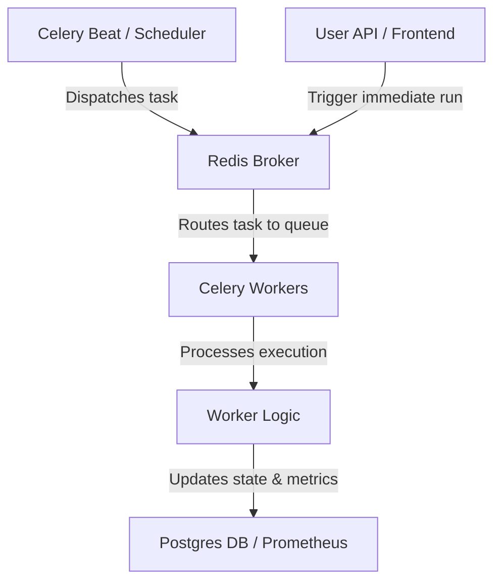
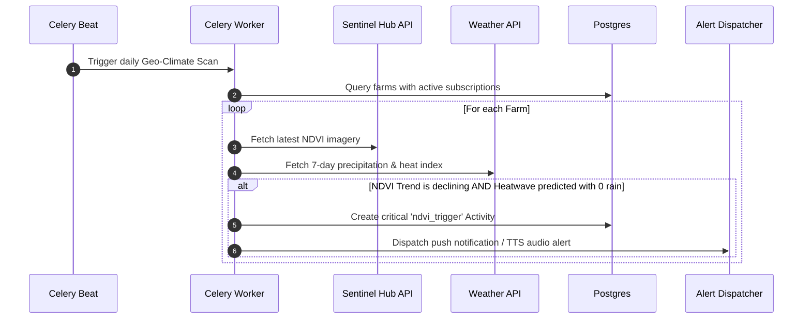
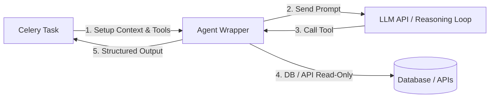
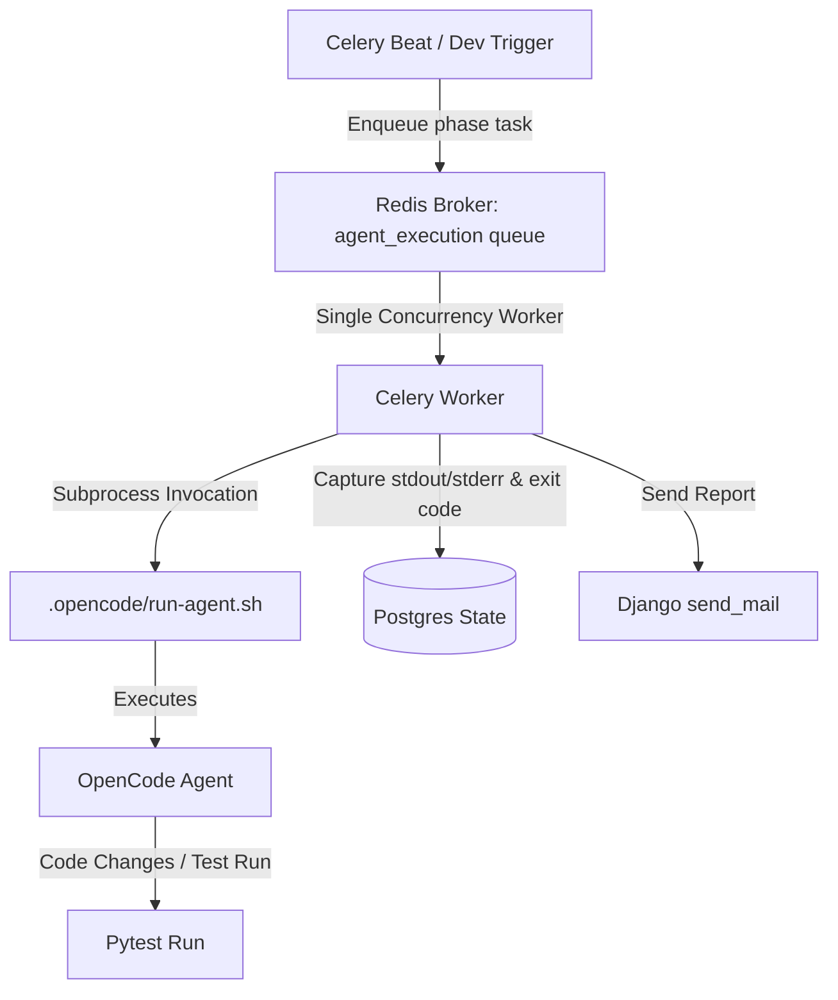

# Automation and Workflow Architecture

This document describes the design, implementation, and target architecture for task automation and background job orchestration within the Farm Intelligence Platform.

---

## 🧭 System Evolution

We are transitioning the platform's background operations from a stateless, unmonitored execution model into a robust, stateful, and observable pipeline.

| Metric | Stateless Cron Pattern | Stateful Queue-Backed Architecture |
| :--- | :--- | :--- |
| **Trigger Mechanism** | Local system `crontab` daemon | `Celery Beat` scheduler (database/code defined) |
| **Task Queue** | None (direct OS execution) | `Redis` message broker with queue isolation |
| **Worker Context** | Shared machine thread | Isolated `Celery` worker pool with time limits |
| **Execution State** | Opaque (log files only) | Persistent database records with detailed tracebacks |
| **Observability** | OS syslog / none | Prometheus metrics + Flower dashboards |
| **Resilience** | Manual execution | Automatic retries with exponential backoffs |

---

## 🧱 Architectural Components



### 1. Control Plane & DB State
The database acts as the single source of truth for all executions. Every workflow has a corresponding record tracking:
* Unique execution ID (`UUIDField`).
* Parameter payload (`JSONField`).
* Execution progress (`StatusChoices`: `queued`, `running`, `success`, `failed`, `retry`).
* Execution history (number of attempts, start/end timestamps).
* Traceback dump (`last_error`) on failure.

### 2. Queue & Broker (Redis)
All tasks are brokered via Redis. Tasks are isolated into queues depending on execution intensity:
* `default`: Fast, transient operations (e.g., sending push alerts).
* `ndvi_ingestion` / `ndvi_recompute`: Heavy geospatial calculations.
* `ndvi_analysis`: Running analytics on NDVI datasets.
* `podcasts_ingestion`: Long-running media polling and parsing.

### 3. Execution Layer (Celery Workers)
Workers consume tasks concurrently from isolated queues. Task limits are enforced at the worker level:
* **Max tasks per child**: Workers are recycled after 100 tasks to prevent Python memory leaks.
* **Time limits**: Tasks have a 4-minute soft limit and 5-minute hard limit to prevent hanging threads.
* **Prefetch multiplier**: Workers fetch only 1 task at a time to distribute workload evenly.

---

## 🗺️ Current System Mapping

The architecture outlined above is fully integrated into the codebase:
* **Celery Configuration**: Configured under [config/celery.py](file:///home/rahim/projects/Farm-Intelligence-Platform/config/celery.py), defining queue isolation, prefetch settings, and signal hooks for request ID propagation.
* **Database State**: The [Activity](file:///home/rahim/projects/Farm-Intelligence-Platform/activities/models.py) model manages scheduled farm tasks, mapping recurrence rules (`cron`, `interval`, `none`) and status lifecycles.
* **Scheduler**: The [poll_activities](file:///home/rahim/projects/Farm-Intelligence-Platform/activities/tasks.py#L65) task runs every 60 seconds via Celery Beat, using a Redis-based cache lock (`_SCHEDULER_LOCK_KEY`) to prevent concurrent dispatcher conflicts.

---

## 🚀 Proposed Extension: Geo-Climate Alert Automation

We propose implementing a new, unified **Geo-Climate Alert Automation** (NDVI + Weather Fusion Engine) to predict crop health degradation.



### Proposed Pseudo-Skeleton Implementation

#### 1. Define the Task Trigger
Inside `ndvi/tasks.py`:

```python
from celery import shared_task
from django.utils import timezone
from farms.models import Farm
from ndvi.engines.stac import StacEngine
from weather.services import ForecastService
from activities.models import Activity

@shared_task(bind=True, queue="ndvi_analysis")
def run_daily_geoclimate_fusion_scan(self):
    """
    Daily job that fetches satellite NDVI data alongside weather forecasts
    to alert farmers of vegetation stress under drought conditions.
    """
    active_farms = Farm.objects.filter(is_active=True)
    
    for farm in active_farms:
        # 1. Check latest NDVI trend
        engine = StacEngine(index_type="NDVI")
        ndvi_stats = engine.get_latest_stats_for_farm(farm)
        
        # 2. Get Weather Forecast
        forecast = ForecastService.get_7_day_forecast(farm.latitude, farm.longitude)
        
        if ndvi_stats.mean < 0.3 and forecast.accumulated_rain == 0.0 and forecast.max_temp > 35.0:
            # 3. Create a stateful Action Activity
            Activity.objects.create(
                farm=farm,
                owner=farm.owner,
                type=Activity.Type.NDVI_TRIGGER,
                status=Activity.Status.PENDING,
                scheduled_at=timezone.now(),
                metadata={
                    "ndvi_value": ndvi_stats.mean,
                    "max_temp": forecast.max_temp,
                    "days_no_rain": 7,
                    "action_required": "Initiate emergency drip-irrigation cycle."
                }
            )
```

#### 2. Celery Beat Schedule Configuration
In [config/celery.py](file:///home/rahim/projects/Farm-Intelligence-Platform/config/celery.py):

```python
app.conf.beat_schedule = {
    "daily-geoclimate-fusion-scan": {
        "task": "ndvi.tasks.run_daily_geoclimate_fusion_scan",
        "schedule": 86400.0, # Every 24 hours
    },
}
```

---

## 📅 Phased Implementation Plan

To deploy this automation safely, the rollout is structured into three progressive phases:

### Phase 1 — Data Fusion & Query Logic
#### Goal
Create the core analytical engine that fetches and evaluates weather forecasts alongside satellite imagery without side effects or alerts.

#### Work
* Implement `GeoClimateEngine` in a new module `ndvi/geoclimate.py`.
* Query existing STAC engines for the latest NDVI stats.
* Query existing weather engines for forecasted rain and temperature trends.
* Write unit tests using mocked external API responses to assert the correctness of target calculations.

#### Exit Criteria
* The engine passes dry-run tests for boundary conditions (e.g., negative temperature, NaN values, missing dates).
* No database models are mutated or alerts fired.

### Phase 2 — Stateful Database Integration & Idempotency
#### Goal
Connect the evaluation logic to the state machine, scheduling recurring tasks and persisting results.

#### Work
* Create the `run_daily_geoclimate_fusion_scan` Celery task.
* Implement idempotency checks: do not create duplicate `ndvi_trigger` Activities if an active one already exists for the farm in the current 24-hour window.
* Configure `daily-geoclimate-fusion-scan` in the Celery Beat schedule.

#### Exit Criteria
* Integrates with the existing [Activity](file:///home/rahim/projects/Farm-Intelligence-Platform/activities/models.py) database model successfully.
* Tasks are correctly routed to the `ndvi_analysis` queue.
* Unit tests confirm that duplicate alert triggers do not produce redundant `Activity` records.

### Phase 3 — Notification Dispatch & Live Rollout
#### Goal
Enable the notification delivery channel (WebSocket, SMS, or TTS audio alerts) and deploy the system live.

#### Work
* Wire the created `Activity` trigger to fire real-time WebSockets and audio alerts through the `alerts` app.
* Register Prometheus metrics tracking the number of triggered anomalies and average scan durations.
* Activate the Celery Beat schedule on production.

#### Exit Criteria
* Alerts are delivered successfully to connected farm owners.
* Prometheus metrics show up in dashboards.
* The system runs smoothly under production load with zero exceptions.

---

## 🤖 Agent Automation & LLM Integration

For complex tasks requiring reasoning (e.g., diagnosing crop diseases from satellite imagery anomalies, or drafting remediation plans based on weather conditions), we can integrate **LLM-based Agent Automation** into the Celery workflow.

### 1. The Agent Isolation Pattern
To run LLM agents safely, we decouple the agent reasoning loop from the execution environment. The agent operates within a restricted execution boundary.



### 2. Guardrails & Safety
* **Read-Only Access**: Agents are provided with tool access restricted to read-only queries (e.g., fetching farm geometry, retrieving NDVI records).
* **Pre-Validated Mutation**: Agents cannot execute raw database writes. If the agent decides an action is required, it returns a structured JSON payload that is validated by standard Django serializers before persistence.
* **Deterministic Fallback**: If the LLM API fails, times out, or returns invalid JSON, the system falls back to a rule-based deterministic alert model.

### 3. Agent Task Skeleton Example

Here is an architectural pattern for wrapping an LLM reasoning agent within a Celery task:

```python
from celery import shared_task
from django.utils import timezone
from activities.models import Activity
from my_llm_sdk import LLMClient  # Example SDK

@shared_task(bind=True, queue="ndvi_analysis", max_retries=2)
def run_llm_diagnostic_agent(self, activity_id: str):
    """
    Enqueues an LLM-based agent to diagnose vegetation stress anomalies and 
    draft a recommended remediation action plan for the farmer.
    """
    activity = Activity.objects.get(id=activity_id)
    
    # 1. Build context
    context = {
        "farm_name": activity.farm.name,
        "ndvi_value": activity.metadata.get("ndvi_value"),
        "max_temp": activity.metadata.get("max_temp"),
        "days_no_rain": activity.metadata.get("days_no_rain"),
    }
    
    # 2. Setup prompt with strict JSON output requirement
    system_prompt = (
        "You are an Agronomy AI Assistant. Analyze the provided farm climate anomaly "
        "and suggest a concrete action plan. Output must be valid JSON with keys: "
        "'diagnosis' (string), and 'remediation_steps' (list of strings)."
    )
    
    try:
        client = LLMClient()
        response = client.generate(
            system_prompt=system_prompt,
            prompt=f"Climate anomaly context: {context}"
        )
        
        # 3. Validate and parse response
        result = response.json()
        
        # 4. Update the activity state and metadata
        activity.metadata["agent_diagnosis"] = result["diagnosis"]
        activity.metadata["action_plan"] = result["remediation_steps"]
        activity.status = Activity.Status.SUCCESS
        activity.save()
        
    except Exception as e:
        # Retry or fallback to deterministic message on failure
        activity.metadata["agent_diagnosis"] = "Drought/heat stress suspected."
        activity.metadata["action_plan"] = ["Check soil moisture", "Verify drip systems."]
        activity.status = Activity.Status.FAILED
        activity.last_error = str(e)
        activity.save()
        raise

---

## 🏗️ .opencode Agent Automation via Celery

To automate codebase transformations and multi-phase agent execution (defined in the `.opencode/` directory), the execution layer leverages a dedicated Celery task wrapper to invoke the `.opencode/run-agent.sh` script.

### 1. Workflow Architecture



### 2. Guardrails & Execution Environment
* **Single Concurrency (`-c 1`)**: Code-writing agents modify the workspace files and run pytest. To avoid file conflicts and git lock collisions, the `agent_execution` queue must be processed by a Celery worker pool size of 1.
* **Timeout Limits**: Since code agents run extensive test suites and multi-step reasoning, the task utilizes a longer soft timeout (e.g., 20 minutes) compared to standard web tasks.
* **Workspace Isolation**: The worker operates directly inside the project root, keeping track of the git state.

### 3. Celery Task Wrapper Implementation

```python
import subprocess
import logging
from celery import shared_task
from django.core.mail import send_mail
from django.conf import settings

logger = logging.getLogger("automation")

@shared_task(
    bind=True, 
    queue="agent_execution", 
    time_limit=1800,  # 30 minutes hard limit
    soft_time_limit=1200 # 20 minutes soft limit
)
def run_opencode_agent_task(self, phase: int):
    """
    Celery task that executes the .opencode agent runner script for a given phase
    and handles state preservation, reporting, and notifications.
    """
    script_path = "/home/rahim/projects/Farm-Intelligence-Platform/.opencode/run-agent.sh"
    
    logger.info(f"Starting .opencode agent for Phase {phase}")
    
    # Invoke the run script via subprocess
    process = subprocess.run(
        [script_path, str(phase)],
        capture_output=True,
        text=True,
        cwd="/home/rahim/projects/Farm-Intelligence-Platform"
    )
    
    exit_code = process.returncode
    stdout_log = process.stdout
    stderr_log = process.stderr
    
    # Build execution report
    report = (
        f"OpenCode Agent Phase {phase} Finished.\n"
        f"Exit Code: {exit_code}\n\n"
        f"=== STDOUT ===\n{stdout_log}\n\n"
        f"=== STDERR ===\n{stderr_log}"
    )
    
    # Log outcomes
    if exit_code == 0:
        logger.info(f"Phase {phase} agent completed successfully.")
    else:
        logger.error(f"Phase {phase} agent failed with exit code {exit_code}.")
        
    # Send email notification using Django's email subsystem
    if getattr(settings, "DEFAULT_FROM_EMAIL", None):
        send_mail(
            subject=f"[Automation] .opencode Phase {phase} Executed",
            message=report,
            from_email=settings.DEFAULT_FROM_EMAIL,
            recipient_list=["rahimranxx8050@gmail.com"],
            fail_silently=False
        )
        
    if exit_code != 0:
        raise RuntimeError(f"Agent execution failed with exit code {exit_code}")
        
    return {"exit_code": exit_code, "phase": phase}
```
```
