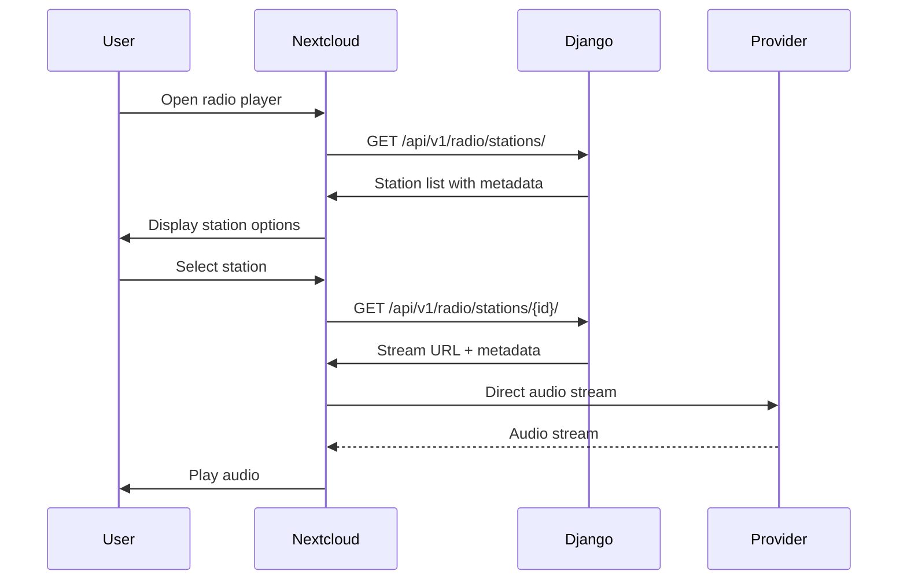
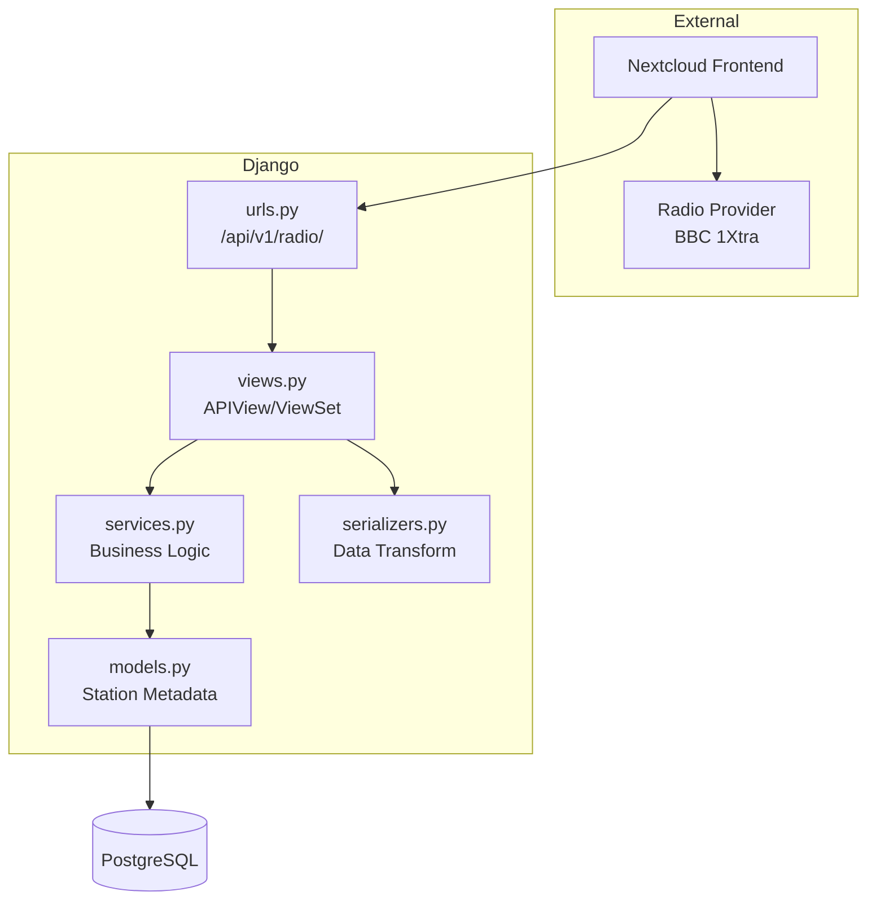

# System Overview

> **Status**: ✅ IMPLEMENTED (MVP)

## Purpose of the Radio Service

The Radio service provides a standardized API for discovering and streaming internet radio stations within the existing Django + Nextcloud ecosystem. It exposes metadata about available stations and their streaming URLs, enabling Nextcloud frontend clients to play live audio content.

### Core Capabilities

- Station discovery via REST API
- Stream URL retrieval for direct playback
- Support for multiple radio providers (extensible)
- Future: favorites, listening history, analytics

## Relationship Between Django and Nextcloud

### Responsibilities

| Layer | Responsibility |
|-------|----------------|
| Django (Radio App) | Station metadata, stream URL management, API contracts |
| Nextcloud | UI rendering, audio playback, user interaction |
| Provider | Audio stream delivery, station uptime |

## Why Radio Belongs in Its Own App

### Isolation Benefits

1. **Clear boundaries**: Radio logic won't pollute other apps
2. **Independent deployment**: Scale radio API independently
3. **Ownership clarity**: Separate concerns for maintenance
4. **Testing simplicity**: Smaller test scope per app

### Alternative Considered

| Option | Verdict | Reason |
|--------|---------|--------|
| Add to `weather` app | Rejected | Unrelated domain, violates app boundaries |
| Add to `activities` app | Rejected | Different lifecycle (live vs scheduled) |
| Standalone `radio` app | Selected | Clear ownership, future extensibility |

### Alignment with Existing Patterns

The project already uses app-based separation:
- `activities/` - Event-driven farm operations
- `api_keys/` - API key management
- `weather/` - Weather data APIs
- `ndvi/` - NDVI processing pipelines

The `radio` app follows the same pattern.

## High-Level Architecture Diagram

## Initial Station: BBC 1Xtra

| Property | Value |
|----------|-------|
| Station ID | `bbc_1xtra` |
| Name | BBC 1Xtra |
| Genre | Hip Hop, R&B, Urban |
| Stream URL | `http://stream.live.vc.bbcmedia.co.uk/bbc_1xtra` |
| Format | MP3 |
| Bitrate | 128kbps |
| Country | UK |
| Language | English |

## Future Extensibility

The architecture supports:

- Additional stations (BBC 1Xtra, BBC Radio 1, etc.)
- Multiple providers (BBC, TuneIn, Radio Browser API)
- Favorites system
- Listening history
- Station health monitoring
- Currently playing metadata