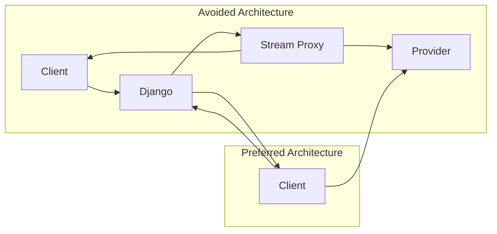
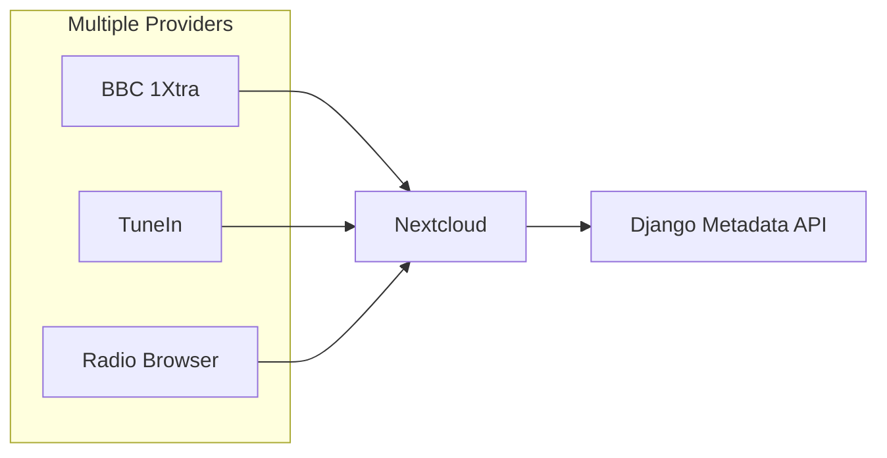

# Streaming Architecture

> **Status**: ✅ IMPLEMENTED (Design pattern followed)

## Why Django Returns Metadata Only

Django serves as the **metadata authority**, not the audio source. This design choice reflects:

1. **Separation of concerns**: Metadata management vs. audio delivery are different problems
2. **Protocol mismatch**: HTTP streaming requires different handling than REST APIs
3. **Statelessness**: REST is stateless; streaming is stateful and long-lived

### What Django Provides

| Data | Purpose |
|------|---------|
| Station name | Display in UI |
| Genre/category | Filtering and display |
| Stream URL | Playback endpoint |
| Provider info | Source attribution |
| Logo URL | Station artwork |

### What Django Does NOT Provide

- Audio bytes
- Stream buffering
- Protocol transcoding

## Why Audio Streams Directly from Provider to Client



### Benefits of Direct Streaming

| Benefit | Explanation |
|---------|--------------|
| **Lower latency** | No intermediate hop; client connects directly |
| **Reduced server load** | Django doesn't handle continuous audio transfer |
| **Bandwidth savings** | Each client pulls their own stream |
| **Provider reliability** | If Django fails, streams continue working |
| **Scalability** | O(1) Django connections regardless of listeners |
| **Protocol flexibility** | Providers optimize their streams; Django doesn't need to understand HLS/DASH |

### Comparison

| Approach | Django Load | Latency | Reliability | Scalability |
|----------|-------------|---------|-------------|--------------|
| **Direct (selected)** | O(1) per station | Low | High | Excellent |
| Proxy through Django | O(listeners) | Higher | Lower | Poor |
| CDN in front | Medium | Medium | High | Excellent (costly) |

## Scalability Considerations

### Current (Direct Streaming)

```
                    ┌─────────────┐
                    │   Provider  │
                    │  (BBC 1Xtra)│
                    └──────┬──────┘
                           │ Direct connection
                           ▼
              ┌────────────────────────────┐
              │        Nextcloud           │
              │      (Multiple users)      │
              └────────────────────────────┘
```

- Django sees 0 additional load for active streams
- Each user maintains their own connection to provider
- No bottleneck at Django layer

### Future: Multiple Providers



- Django manages provider metadata, not streams
- Easy to add/remove providers without affecting playback
- Each provider maintains their own streaming infrastructure

## Avoiding Proxy Stream Bottlenecks

### What We Don't Do

```python
# DON'T: Proxy streaming through Django
def stream_audio(request, station_id):
    stream_url = get_stream_url(station_id)
    response = requests.get(stream_url, stream=True)
    return StreamingHttpResponse(response.iter_content())
```

### Problems with Proxing

1. **Memory pressure**: Streaming large audio files consumes RAM
2. **Connection limits**: Each listener ties up a Django worker
3. **Bandwidth costs**: Server pays for all outbound audio
4. **Single point of failure**: Django downtime stops all streams
5. **No HLS/DASH support**: Would need transcoding infrastructure

### What We Do Instead

```python
# DO: Return metadata and let client stream directly
class StationStreamView(APIView):
    def get(self, request, station_id):
        station = get_object_or_404(Station, id=station_id)
        return Response({
            "stream_url": station.stream_url,
            "format": station.format,
            "bitrate": station.bitrate
        })
```

The client (Nextcloud) then makes a direct HTTP connection to the stream URL.

## Provider Availability Handling

Since streams go directly to clients, Django can still provide value:

1. **Health checks**: Monitor provider availability
2. **Fallback URLs**: If primary stream fails, return backup URL
3. **Status endpoint**: Let clients check station availability

```python
class StationHealthView(APIView):
    def get(self, request, station_id):
        station = get_object_or_404(Station, id=station_id)
        is_available = check_stream_availability(station.stream_url)
        return Response({
            "station_id": station_id,
            "available": is_available,
            "checked_at": timezone.now()
        })
```