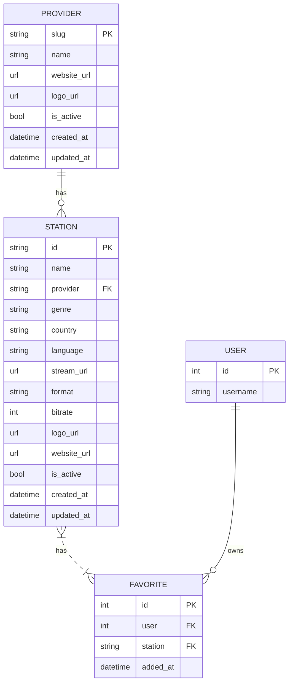

# Data Model Planning

## Station Metadata Schema

### Provider Model

Represents a radio provider (BBC, TuneIn, Radio Browser, etc.):

```python
# radio/models.py

class Provider(models.Model):
    """Radio streaming provider."""

    slug = models.SlugField(max_length=50, primary_key=True)
    name = models.CharField(max_length=200)
    website_url = models.URLField(blank=True)
    logo_url = models.URLField(blank=True)
    is_active = models.BooleanField(default=True)
    created_at = models.DateTimeField(auto_now_add=True)
    updated_at = models.DateTimeField(auto_now=True)

    class Meta:
        db_table = "radio_provider"
        verbose_name = "Provider"
        verbose_name_plural = "Providers"

    def __str__(self):
        return self.name
```

### Station Model

Represents a radio station:

```python
# radio/models.py

class Station(models.Model):
    """Radio station with streaming metadata."""

    id = models.CharField(max_length=50, primary_key=True)
    name = models.CharField(max_length=200)
    provider = models.ForeignKey(
        Provider,
        on_delete=models.PROTECT,
        related_name="stations"
    )
    genre = models.CharField(max_length=100, blank=True)
    country = models.CharField(max_length=100)
    language = models.CharField(max_length=100)
    stream_url = models.URLField()
    format = models.CharField(max_length=20, default="MP3")  # MP3, AAC, HLS
    bitrate = models.IntegerField(default=128)  # kbps
    logo_url = models.URLField(blank=True)
    website_url = models.URLField(blank=True)
    is_active = models.BooleanField(default=True)
    created_at = models.DateTimeField(auto_now_add=True)
    updated_at = models.DateTimeField(auto_now=True)

    class Meta:
        db_table = "radio_station"
        verbose_name = "Station"
        verbose_name_plural = "Stations"
        ordering = ["name"]
        indexes = [
            models.Index(fields=["is_active"]),
            models.Index(fields=["provider"]),
            models.Index(fields=["genre"]),
        ]

    def __str__(self):
        return f"{self.name} ({self.provider.name})"
```

## Required Fields

### Station (MVP)

| Field | Type | Required | Description |
|-------|------|----------|-------------|
| `id` | string | Yes | Unique station identifier (e.g., `bbc_1xtra`) |
| `name` | string | Yes | Display name (e.g., "BBC 1Xtra") |
| `provider` | FK | Yes | Reference to Provider |
| `stream_url` | URL | Yes | Direct stream endpoint |
| `country` | string | Yes | Country of origin |
| `language` | string | Yes | Primary language |
| `is_active` | bool | Yes | Whether station is available |

### Provider (MVP)

| Field | Type | Required | Description |
|-------|------|----------|-------------|
| `slug` | slug | Yes | Unique identifier (e.g., `bbc`) |
| `name` | string | Yes | Display name |
| `is_active` | bool | Yes | Whether provider is available |

## Optional Future Fields

### Station Extensions

| Field | Type | Description |
|-------|------|-------------|
| `description` | text | Station description |
| `genre` | string | Music genre |
| `bitrate` | int | Stream bitrate in kbps |
| `format` | string | Audio format (MP3, AAC, HLS) |
| `logo_url` | string | Station artwork |
| `website_url` | string | Station website |
| `last_checked` | datetime | Last health check timestamp |
| `is_available` | bool | Current availability status |

### Future Models

#### Listening History

```python
class ListeningHistory(models.Model):
    """Track user listening sessions."""

    user = models.ForeignKey(
        settings.AUTH_USER_MODEL,
        on_delete=models.CASCADE,
        related_name="radio_history"
    )
    station = models.ForeignKey(Station, on_delete=models.CASCADE)
    started_at = models.DateTimeField(auto_now_add=True)
    ended_at = models.DateTimeField(null=True, blank=True)
    duration_seconds = models.IntegerField(default=0)
```

#### Favorites

```python
class FavoriteStation(models.Model):
    """User's favorite stations."""

    user = models.ForeignKey(
        settings.AUTH_USER_MODEL,
        on_delete=models.CASCADE,
        related_name="radio_favorites"
    )
    station = models.ForeignKey(Station, on_delete=models.CASCADE)
    added_at = models.DateTimeField(auto_now_add=True)

    class Meta:
        unique_together = ["user", "station"]
```

#### Station Analytics

```python
class StationAnalytics(models.Model):
    """Aggregate station usage metrics."""

    station = models.ForeignKey(Station, on_delete=models.CASCADE)
    date = models.DateField()
    total_listens = models.IntegerField(default=0)
    total_duration_seconds = models.IntegerField(default=0)
    unique_users = models.IntegerField(default=0)

    class Meta:
        unique_together = ["station", "date"]
```

#### Station Health Check

```python
class StationHealthCheck(models.Model):
    """Track station availability over time."""

    station = models.ForeignKey(Station, on_delete=models.CASCADE)
    checked_at = models.DateTimeField(auto_now_add=True)
    is_reachable = models.BooleanField()
    response_time_ms = models.IntegerField(null=True)
    status_code = models.IntegerField(null=True)
    error_message = models.TextField(blank=True)
```

#### Currently Playing Metadata

```python
class NowPlaying(models.Model):
    """Current track metadata from station (if available)."""

    station = models.OneToOneField(Station, on_delete=models.CASCADE)
    track_title = models.CharField(max_length=500, blank=True)
    artist = models.CharField(max_length=500, blank=True)
    album = models.CharField(max_length=500, blank=True)
    artwork_url = models.URLField(blank=True)
    updated_at = models.DateTimeField(auto_now=True)
```

## Database Schema Diagram



## Migration Strategy

1. **Initial migration**: Create `Provider` and `Station` tables
2. **Seed data**: Load BBC 1Xtra as initial station
3. **Future migrations**: Add new tables as needed (no migration for unused features)