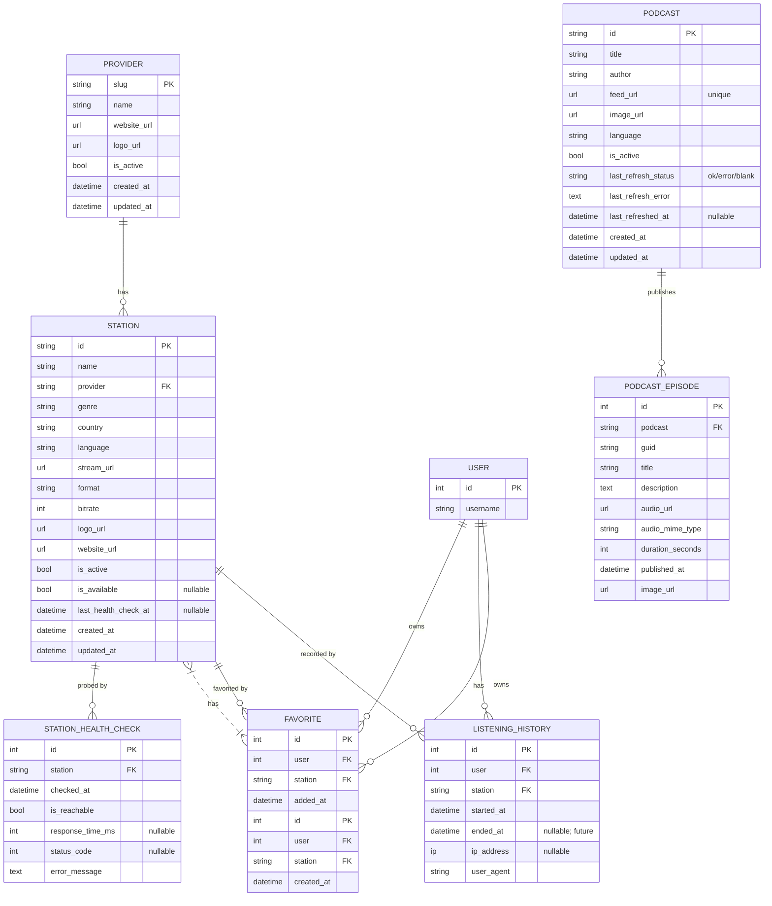

# Data Model Planning

> **Status**: ✅ IMPLEMENTED (Station + Provider + StationHealthCheck +
> Favorite + ListeningHistory models, `is_available` / `last_health_check_at`
> fields on Station)

## Station Metadata Schema

### Provider Model

Represents a radio provider (BBC, TuneIn, Radio Browser, etc.):

```python
# radio/models.py

class Provider(models.Model):
    """Radio streaming provider."""

    slug = models.SlugField(max_length=50, primary_key=True)
    name = models.CharField(max_length=200)
    website_url = models.URLField(blank=True)
    logo_url = models.URLField(blank=True)
    is_active = models.BooleanField(default=True)
    created_at = models.DateTimeField(auto_now_add=True)
    updated_at = models.DateTimeField(auto_now=True)

    class Meta:
        db_table = "radio_provider"
        verbose_name = "Provider"
        verbose_name_plural = "Providers"

    def __str__(self):
        return self.name
```

### Station Model

Represents a radio station:

```python
# radio/models.py

class Station(models.Model):
    """Radio station with streaming metadata."""

    id = models.CharField(max_length=50, primary_key=True)
    name = models.CharField(max_length=200)
    provider = models.ForeignKey(
        Provider,
        on_delete=models.PROTECT,
        related_name="stations"
    )
    genre = models.CharField(max_length=100, blank=True)
    country = models.CharField(max_length=100)
    language = models.CharField(max_length=100)
    stream_url = models.URLField()
    format = models.CharField(max_length=20, default="MP3")  # MP3, AAC, HLS
    bitrate = models.IntegerField(default=128)  # kbps
    logo_url = models.URLField(blank=True)
    website_url = models.URLField(blank=True)
    is_active = models.BooleanField(default=True)
    created_at = models.DateTimeField(auto_now_add=True)
    updated_at = models.DateTimeField(auto_now=True)

    class Meta:
        db_table = "radio_station"
        verbose_name = "Station"
        verbose_name_plural = "Stations"
        ordering = ["name"]
        indexes = [
            models.Index(fields=["is_active"]),
            models.Index(fields=["provider"]),
            models.Index(fields=["genre"]),
        ]

    def __str__(self):
        return f"{self.name} ({self.provider.name})"
```

## Required Fields

### Station (MVP)

| Field | Type | Required | Description |
|-------|------|----------|-------------|
| `id` | string | Yes | Unique station identifier (e.g., `bbc_1xtra`) |
| `name` | string | Yes | Display name (e.g., "BBC 1Xtra") |
| `provider` | FK | Yes | Reference to Provider |
| `stream_url` | URL | Yes | Direct stream endpoint |
| `country` | string | Yes | Country of origin |
| `language` | string | Yes | Primary language |
| `is_active` | bool | Yes | Whether station is available |

### Provider (MVP)

| Field | Type | Required | Description |
|-------|------|----------|-------------|
| `slug` | slug | Yes | Unique identifier (e.g., `bbc`) |
| `name` | string | Yes | Display name |
| `is_active` | bool | Yes | Whether provider is available |

## Optional Future Fields

### Station Extensions

| Field | Type | Description | Status |
|-------|------|-------------|--------|
| `description` | text | Station description | ⏳ planned |
| `genre` | string | Music genre | ⏳ planned |
| `bitrate` | int | Stream bitrate in kbps | ⏳ planned |
| `format` | string | Audio format (MP3, AAC, HLS) | ⏳ planned |
| `logo_url` | string | Station artwork | ⏳ planned |
| `website_url` | string | Station website | ⏳ planned |
| `last_health_check_at` | datetime (nullable) | Timestamp of the most recent probe. `null` until first probe. | ✅ shipped 2026-06-03 |
| `is_available` | bool (nullable) | Result of the last probe. `null` = never checked, `true` = reachable, `false` = unreachable. | ✅ shipped 2026-06-03 |

### Future Models

#### Station Health Check (✅ shipped 2026-06-03)

The model that was sketched here as a future model is now implemented at
`radio/models.py:StationHealthCheck`. The migration is `radio/migrations/0003_station_health_check.py`.
Indexes:

- `idx_station_checked` — composite `(station, -checked_at)` for time-series reads.
- `db_index=True` on `checked_at` for window queries.

```python
# radio/models.py — actual implementation
class StationHealthCheck(models.Model):
    """One row per probe of a station's stream URL."""

    station = models.ForeignKey(
        Station, on_delete=models.CASCADE, related_name="health_checks"
    )
    checked_at = models.DateTimeField(auto_now_add=True, db_index=True)
    is_reachable = models.BooleanField()
    response_time_ms = models.IntegerField(blank=True, null=True)
    status_code = models.IntegerField(blank=True, null=True)
    error_message = models.TextField(blank=True)

    class Meta:
        db_table = "radio_station_health_check"
        verbose_name = "Station health check"
        verbose_name_plural = "Station health checks"
        ordering = ["-checked_at"]
        indexes = [models.Index(fields=["station", "-checked_at"])]
```

#### Listening History (✅ shipped 2026-06-04)

The model sketched here is now implemented at
`radio/models.py:ListeningHistory`. The migration is
`radio/migrations/0004_favorite_listeninghistory.py`. The
`ended_at` field exists but is reserved for a future client-driven
stop event; today every row is created by `StationStreamView` with
`ended_at = NULL`. The `duration_seconds` field is **not** part of
the current model — it can be derived from `ended_at - started_at`
once stop events exist.

```python
# radio/models.py — actual implementation
class ListeningHistory(models.Model):
    """A row recording that a user fetched a station's stream URL."""

    user = models.ForeignKey(
        settings.AUTH_USER_MODEL,
        on_delete=models.CASCADE,
        related_name="radio_listening_history",
    )
    station = models.ForeignKey(
        Station, on_delete=models.CASCADE, related_name="listening_history"
    )
    started_at = models.DateTimeField(auto_now_add=True, db_index=True)
    ended_at = models.DateTimeField(null=True, blank=True)
    ip_address = models.GenericIPAddressField(null=True, blank=True)
    user_agent = models.CharField(max_length=200, blank=True)

    class Meta:
        db_table = "radio_listening_history"
        ordering = ["-started_at"]
        indexes = [models.Index(fields=["user", "-started_at"])]
```

#### Favorites (✅ shipped 2026-06-04)

The model sketched here is now implemented at
`radio/models.py:Favorite`. The `added_at` field was renamed to
`created_at` and the pair `(user, station)` is enforced unique at
the database level via a `UniqueConstraint` named
`radio_favorite_user_station_unique`.

```python
# radio/models.py — actual implementation
class Favorite(models.Model):
    """A user's favorite radio station."""

    user = models.ForeignKey(
        settings.AUTH_USER_MODEL,
        on_delete=models.CASCADE,
        related_name="radio_favorites",
    )
    station = models.ForeignKey(
        Station, on_delete=models.CASCADE, related_name="favorited_by"
    )
    created_at = models.DateTimeField(auto_now_add=True)

    class Meta:
        db_table = "radio_favorite"
        ordering = ["-created_at"]
        constraints = [
            models.UniqueConstraint(
                fields=["user", "station"],
                name="radio_favorite_user_station_unique",
            ),
        ]
        indexes = [models.Index(fields=["user", "-created_at"])]
```

#### Podcast and PodcastEpisode (✅ shipped 2026-06-04)

`Podcast` and `PodcastEpisode` are implemented in the new top-level
`podcasts/` app (see `podcasts/models.py`). They are intentionally
separate from `Station` / `Provider` because podcasts have a different
ingestion cadence, schema, and operational profile.

- `Podcast.id` is a short slug PK (human-readable).
- `Podcast.feed_url` is `URLField` (HTTP/HTTPS only, validator-enforced)
  and unique.
- `PodcastEpisode.podcast` FK cascades on delete.
- `unique(podcast, guid)` lets the same guid appear under different
  podcasts without collision.
- `(podcast, -published_at)` composite index supports the "newest
  first" episode feed.
- `last_refresh_status` (`ok`/`error`/`""`), `last_refresh_error` (capped
  at 500 chars), and `last_refreshed_at` let operators see at a glance
  which feeds are broken.

#### Station Analytics

```python
class StationAnalytics(models.Model):
    """Aggregate station usage metrics."""

    station = models.ForeignKey(Station, on_delete=models.CASCADE)
    date = models.DateField()
    total_listens = models.IntegerField(default=0)
    total_duration_seconds = models.IntegerField(default=0)
    unique_users = models.IntegerField(default=0)

    class Meta:
        unique_together = ["station", "date"]
```

#### Currently Playing Metadata

```python
class NowPlaying(models.Model):
    """Current track metadata from station (if available)."""

    station = models.OneToOneField(Station, on_delete=models.CASCADE)
    track_title = models.CharField(max_length=500, blank=True)
    artist = models.CharField(max_length=500, blank=True)
    album = models.CharField(max_length=500, blank=True)
    artwork_url = models.URLField(blank=True)
    updated_at = models.DateTimeField(auto_now=True)
```

## Database Schema Diagram



## Migration Strategy

1. **Initial migration** (`0001_initial`): Create `Provider` and `Station` tables
2. **`0002_add_provider_type`**: Add `Provider.provider_type`
3. **Seed data**: Load BBC 1Xtra as initial station
4. **`0003_station_health_check` (Phase 2, 2026-06-03)**: Add `is_available`,
   `last_health_check_at` to `Station`; create `StationHealthCheck` with
   composite `(station, -checked_at)` index
5. **`0004_favorite_listeninghistory` (Phase 3, 2026-06-04)**: Create
   `Favorite` (with `unique(user, station)`) and `ListeningHistory`
6. **`podcasts/0001_initial` (Phase 4, 2026-06-04)**: New top-level
   `podcasts/` app — create `Podcast` (with unique `feed_url`) and
   `PodcastEpisode` (with `unique(podcast, guid)` and composite
   `(podcast, -published_at)` index).
7. **Future migrations**: Add new tables as needed (no migration for unused features)