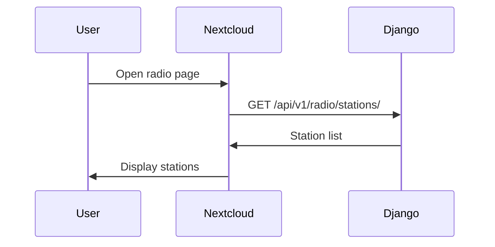
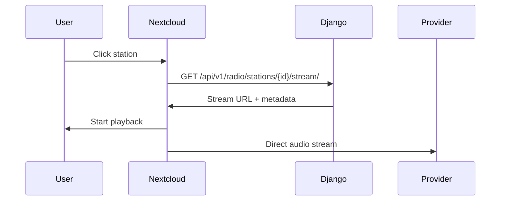
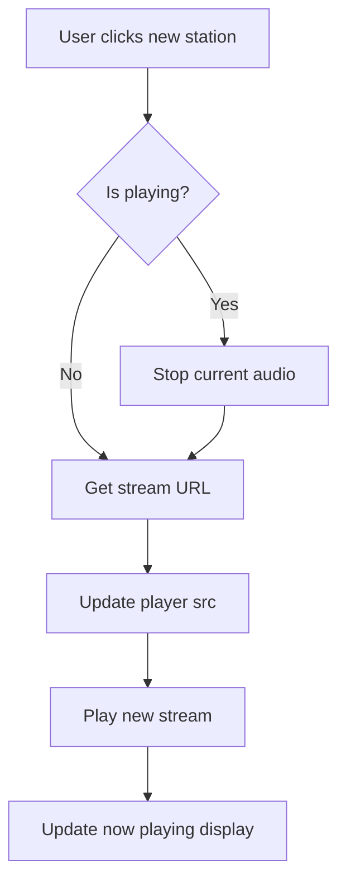

# Nextcloud Integration Design

## Expected Frontend Consumption Flow

### 1. Load Station List

```javascript
// Nextcloud JavaScript
async function loadStations() {
    const response = await fetch('/api/v1/radio/stations/');
    const data = await response.json();

    if (data.success === 0) {
        return data.data.results;
    }
    throw new Error(data.message);
}
```

### 2. Display Stations

```html
<!-- Nextcloud template -->
<div id="radio-stations">
    <div v-for="station in stations" :key="station.id">
        
        <h3>{{ station.name }}</h3>
        <p>{{ station.genre }} - {{ station.country }}</p>
        <button @click="playStation(station.id)">Play</button>
    </div>
</div>
```

### 3. Get Stream URL

```javascript
async function playStation(stationId) {
    const response = await fetch(`/api/v1/radio/stations/${stationId}/stream/`);
    const data = await response.json();

    if (data.success === 0) {
        playAudio(data.data.stream_url, data.data);
    }
}

function playAudio(url, metadata) {
    const audio = new Audio(url);
    audio.metadata = metadata;
    audio.play();
}
```

## Audio Playback Strategy

### Native HTML5 Audio

Simplest integration using browser's built-in player:

```html
<audio id="radio-player" controls>
    Your browser does not support audio.
</audio>

<script>
const player = document.getElementById('radio-player');

async function playStation(stationId) {
    const response = await fetch(`/api/v1/radio/stations/${stationId}/stream/`);
    const { data } = await response.json();
    player.src = data.stream_url;
    player.play();
}
</script>
```

### Nextcloud App Integration

For deeper Nextcloud integration:

```javascript
// Use Nextcloud's audio API if available
import { showMessage } from '@nextcloud/dialogs';

async function playStation(stationId) {
    try {
        const response = await fetch(`/api/v1/radio/stations/${stationId}/stream/`);
        const { data } = await response.json();

        // Update Now Playing status
        updateNowPlaying(data);

        // Start playback
        const audio = new Audio(data.stream_url);
        audio.play();
    } catch (error) {
        showMessage(t('radio', 'Failed to play station'), 'error');
    }
}
```

### Audio Player Features

| Feature | Implementation |
|---------|----------------|
| Play/Pause | HTML5 audio controls |
| Volume | HTML5 audio controls |
| Station info | Overlay on player |
| Now Playing | Fetch periodically or via WebSocket |
| Error handling | Display toast on failure |

## Metadata Retrieval Flow

### Initial Load



### On Station Select



### Optional: Now Playing Updates

If station provides track metadata:

```javascript
async function getNowPlaying(stationId) {
    const response = await fetch(`/api/v1/radio/stations/${stationId}/now-playing/`);
    const { data } = await response.json();
    return data;
}

// Poll every 30 seconds
setInterval(() => {
    if (currentStation) {
        getNowPlaying(currentStation.id).then(updateUI);
    }
}, 30000);
```

## Dynamic Station Switching Strategy

### Switching Flow



### Implementation

```javascript
let currentAudio = null;

async function switchStation(newStationId) {
    // Stop current playback
    if (currentAudio) {
        currentAudio.pause();
        currentAudio = null;
    }

    // Get new stream URL
    const response = await fetch(`/api/v1/radio/stations/${newStationId}/stream/`);
    const { data } = await response.json();

    // Create new audio element
    currentAudio = new Audio(data.stream_url);

    // Set up event handlers
    currentAudio.onplay = () => updatePlayState(true);
    currentAudio.onpause = () => updatePlayState(false);
    currentAudio.onerror = () => handlePlaybackError();

    // Start playback
    await currentAudio.play();
    updateNowPlayingDisplay(data);
}
```

### Pre-loading

To minimize switching delay:

```javascript
// Pre-load next likely station when user hovers
function preloadStation(stationId) {
    fetch(`/api/v1/radio/stations/${stationId}/stream/`)
        .then(r => r.json())
        .then(data => {
            // Cache the URL for quick switching
            stationCache.set(stationId, data.data);
        });
}
```

## Error Handling in Nextcloud

| Error | User Message | Action |
|-------|--------------|--------|
| Network offline | "No internet connection" | Show offline indicator |
| Station unavailable | "Station is currently unavailable" | Offer retry |
| Stream URL invalid | "Unable to play this station" | Suggest alternative |
| CORS blocked | "Playback blocked by browser" | Show troubleshooting |

## Integration Checklist

- [ ] Station list endpoint integration
- [ ] Stream URL retrieval
- [ ] Audio playback (HTML5)
- [ ] Play/pause controls
- [ ] Station artwork display
- [ ] Error handling
- [ ] Loading states
- [ ] CORS configuration