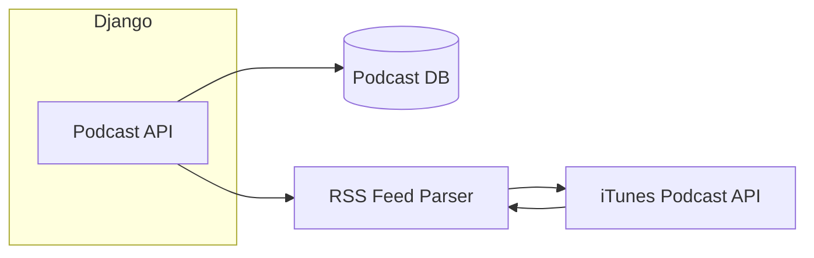
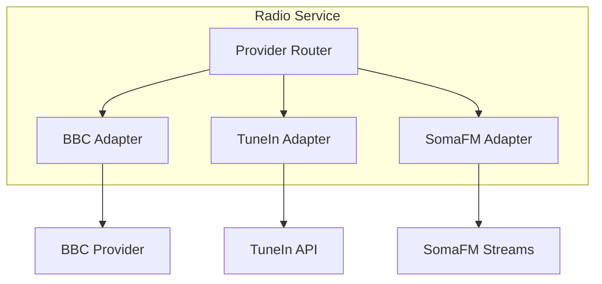

# Future Expansion Planning

> **Status**: Current implementation includes BBC, SomaFM, and TuneIn providers

## Additional Radio Stations

### Phase 2: More BBC Stations ✅ DONE

| Station | ID | Genre |
|---------|-----|-------|
| BBC Radio 1 | `bbc_radio1` | Pop, Chart |
| BBC Radio 1Xtra | `bbc_1xtra` | Hip Hop, R&B |
| BBC Radio 2 | `bbc_radio2` | Adult Contemporary |

### Phase 3: Other Providers ✅ DONE

| Provider | Type | Integration | Stations |
|----------|------|-------------|----------|
| TuneIn | Aggregator | API-based station list | 1 (BBC WS) |
| SomaFM | Independent | Direct stream URLs | 8 |
| Radio Browser API | Open | Not implemented | - | |

### Provider Model Extension

```python
# radio/models.py

class ProviderType(models.TextChoices):
    BROADCASTER = "broadcaster", "Direct Broadcaster"
    AGGREGATOR = "aggregator", "Station Aggregator"
    API_BASED = "api_based", "API-driven"

class Provider(models.Model):
    # ... existing fields ...
    provider_type = models.CharField(
        max_length=20,
        choices=ProviderType.choices,
        default=ProviderType.BROADCASTER
    )
    api_endpoint = models.URLField(blank=True)  # For API-based providers
    api_key = models.CharField(max_length=200, blank=True)  # Encrypted
```

## Podcasts

### Architecture



### Models

```python
class Podcast(models.Model):
    """Podcast show."""

    id = models.CharField(max_length=50, primary_key=True)
    title = models.CharField(max_length=500)
    description = models.TextField()
    feed_url = models.URLField()
    image_url = models.URLField()
    author = models.CharField(max_length=200)
    is_active = models.BooleanField(default=True)


class PodcastEpisode(models.Model):
    """Individual podcast episode."""

    podcast = models.ForeignKey(Podcast, on_delete=models.CASCADE)
    guid = models.CharField(max_length=200)
    title = models.CharField(max_length=500)
    description = models.TextField()
    audio_url = models.URLField()
    duration_seconds = models.IntegerField()
    published_at = models.DateTimeField()
```

### Endpoints

| Method | Path | Description |
|--------|------|-------------|
| GET | `/api/v1/radio/podcasts/` | List podcasts |
| GET | `/api/v1/radio/podcasts/{id}/` | Podcast details |
| GET | `/api/v1/radio/podcasts/{id}/episodes/` | List episodes |
| GET | `/api/v1/radio/episodes/{id}/stream/` | Get episode stream URL |

## Emergency Broadcasts

### Use Cases

- Weather alerts
- Farm emergency notifications
- Critical system alerts

### Implementation

```python
# radio/models.py

class EmergencyBroadcast(models.Model):
    """Emergency broadcast message."""

    PRIORITY_CHOICES = [
        ("low", "Low"),
        ("medium", "Medium"),
        ("high", "High"),
        ("critical", "Critical"),
    ]

    title = models.CharField(max_length=500)
    message = models.TextField()
    priority = models.CharField(max_length=20, choices=PRIORITY_CHOICES)
    starts_at = models.DateTimeField()
    ends_at = models.DateTimeField()
    is_active = models.BooleanField(default=True)
```

### Endpoints

| Method | Path | Description |
|--------|------|-------------|
| GET | `/api/v1/radio/emergency/current/` | Get active emergency |
| GET | `/api/v1/radio/emergency/history/` | Past broadcasts |

### Nextcloud Integration

```javascript
// Check for emergency on page load
async function checkEmergency() {
    const response = await fetch('/api/v1/radio/emergency/current/');
    const { data } = await response.json();

    if (data && data.priority === 'critical') {
        showEmergencyOverlay(data);
    }
}
```

## Farm Audio Alerts

### Trigger Sources

| Source | Description |
|--------|-------------|
| Weather API | Severe weather warnings |
| NDVI Pipeline | Crop health alerts |
| Activity System | Scheduled task failures |
| Custom rules | User-defined conditions |

### Alert Types

| Type | Audio | Visual |
|------|-------|--------|
| Weather warning | TTS: "Weather alert: {message}" | Banner |
| Crop health | TTS: "Crop alert: {message}" | Banner |
| System failure | TTS: "System alert: {message}" | Banner |

### Text-to-Speech Integration

```python
# radio/services.py

class TTSService:
    """Convert text to speech for alerts."""

    def synthesize(self, text: str) -> bytes:
        # Use Google Cloud TTS, AWS Polly, or similar
        pass


class AlertService:
    """Farm alert management."""

    def create_audio_alert(self, alert: Alert) -> AudioAlert:
        tts = TTSService()
        audio_data = tts.synthesize(alert.message)
        return AudioAlert.objects.create(
            alert=alert,
            audio_data=audio_data,
            duration_seconds=calculate_duration(audio_data)
        )
```

## TTS Integrations

### Providers

| Provider | Quality | Cost | Languages |
|----------|---------|------|-----------|
| Google Cloud TTS | High | Pay-per-use | Many |
| AWS Polly | High | Pay-per-use | Many |
| Microsoft Azure | High | Pay-per-use | Many |
| Coqui (self-hosted) | Medium | Free | Limited |

### Implementation

```python
# radio/services/tts.py

class TTSProvider(ABC):
    @abstractmethod
    def synthesize(self, text: str, voice: str) -> bytes:
        pass


class GoogleTTSProvider(TTSProvider):
    def synthesize(self, text: str, voice: str = "en-US-Neural2-F") -> bytes:
        # Implementation
        pass
```

### Endpoint

```python
# radio/views.py

class TTSView(APIView):
    def post(self, request):
        serializer = TTSRequestSerializer(data=request.data)
        serializer.is_valid(raise_exception=True)

        text = serializer.validated_data["text"]
        voice = serializer.validated_data.get("voice", "default")

        audio_data = tts_service.synthesize(text, voice)

        return HttpResponse(audio_data, content_type="audio/mp3")
```

## Multi-Provider Architecture

### Overview



### Abstract Provider Interface

```python
# radio/providers/base.py

class RadioProvider(ABC):
    """Abstract base class for radio providers."""

    @abstractmethod
    def get_stations(self) -> list[StationData]:
        """Return list of available stations."""
        pass

    @abstractmethod
    def get_stream_url(self, station_id: str) -> str:
        """Return stream URL for station."""
        pass

    @abstractmethod
    def health_check(self, station_id: str) -> bool:
        """Check if station is available."""
        pass


class BBCProvider(RadioProvider):
    """BBC radio provider implementation."""

    def get_stations(self) -> list[StationData]:
        # Hardcoded or config-based
        pass


class TuneInProvider(RadioProvider):
    """TuneIn aggregator implementation."""

    def get_stations(self) -> list[StationData]:
        # API-based
        pass
```

### Provider Registry

```python
# radio/providers/registry.py

PROVIDER_REGISTRY: dict[str, type[RadioProvider]] = {
    "bbc": BBCProvider,
    "tunein": TuneInProvider,
    "somafm": SomaFMProvider,
}


def get_provider(slug: str) -> RadioProvider:
    provider_class = PROVIDER_REGISTRY.get(slug)
    if not provider_class:
        raise ProviderNotFoundError(slug)
    return provider_class()
```

### Integration Points

| Feature | BBC | TuneIn | SomaFM |
|---------|-----|--------|--------|
| Station list | Config | API | Config |
| Stream URLs | Config | API | Config |
| Metadata | Config | API | Config |
| Health checks | HTTP check | API check | HTTP check |

## Feature Roadmap

| Priority | Feature | Complexity | Dependencies | Status |
|----------|---------|------------|--------------|--------|
| P0 | BBC 1Xtra MVP | Low | None | ✅ shipped 2026-05 |
| P1 | More BBC stations | Low | P0 | ✅ shipped (8 BBC stations seeded) |
| P2 | Station health checks | Medium | P0 | ✅ shipped 2026-06-03 — see `09_operational.md` § Health Checks |
| P3 | Favorites | Medium | Auth | ✅ shipped 2026-06-04 — see `IMPLEMENTATION_SUMMARY.md` § Phase 3 |
| P3 | Listening history | Medium | Auth | ✅ shipped 2026-06-04 — see `IMPLEMENTATION_SUMMARY.md` § Phase 3 |
| P4 | Podcasts | High | P0 | ⏳ planned |
| P4 | Farm audio alerts | High | Activities, NDVI | ⏳ planned |
| P5 | Emergency broadcasts | Medium | P0 | ⏳ planned |
| P5 | TTS | High | External API |
