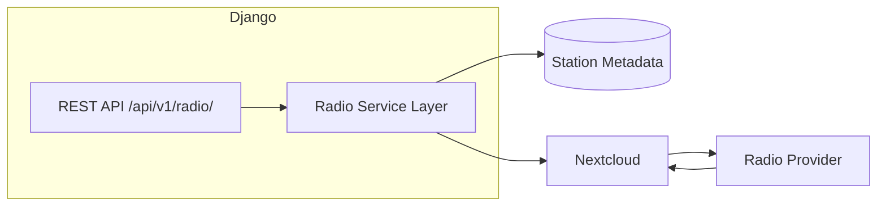

# Radio Service Architecture

This directory contains the technical design documentation for the Radio app integration.

## Document Index

| # | Document | Description |
|---|----------|-------------|
| 01 | [System Overview](./01_system_overview.md) | Purpose, architecture, and high-level design |
| 02 | [API Architecture](./02_api_architecture.md) | Endpoints, versioning, response formats |
| 03 | [Streaming Architecture](./03_streaming_architecture.md) | Direct streaming vs proxy considerations |
| 04 | [App Structure](./04_app_structure.md) | Folder hierarchy and service layer design |
| 05 | [Data Model Planning](./05_data_model.md) | Station metadata schema and future fields |
| 06 | [Security Architecture](./06_security.md) | Authentication, throttling, HTTPS |
| 07 | [Nextcloud Integration](./07_nextcloud_integration.md) | Frontend consumption and playback strategy |
| 08 | [Future Expansion](./08_future_expansion.md) | Additional stations, podcasts, alerts |
| 09 | [Operational Considerations](./09_operational.md) | Logging, monitoring, health checks |

## Architecture Overview

The Radio service provides internet radio streaming integration with the Django + Nextcloud ecosystem.

## Key Design Decisions

- **Metadata API only**: Django returns station info, not audio
- **Direct streaming**: Audio flows from provider to client, bypassing Django
- **App separation**: Radio in its own Django app for isolation
- **Future-proof**: Schema supports favorites, history, analytics

## Quick Links

- [System Overview](./01_system_overview.md)
- [API Architecture](./02_api_architecture.md)
- [Streaming Architecture](./03_streaming_architecture.md)
- [ADR - Dedicated App Decision](./adr/001_dedicated_radio_app.md)
- [ADR - No Stream Proxying](./adr/002_no_stream_proxying.md)
- [ADR - Metadata APIs Preferred](./adr/003_metadata_apis_preferred.md)
- [ADR - Direct Provider Streaming](./adr/004_direct_provider_streaming.md)

## ADRs (Architecture Decision Records)

| # | Document | Description |
|---|----------|-------------|
| 001 | [Dedicated Radio App](./adr/001_dedicated_radio_app.md) | Why radio gets its own app |
| 002 | [No Stream Proxying](./adr/002_no_stream_proxying.md) | Why Django doesn't proxy audio |
| 003 | [Metadata APIs Preferred](./adr/003_metadata_apis_preferred.md) | Why Django returns metadata only |
| 004 | [Direct Provider Streaming](./adr/004_direct_provider_streaming.md) | Why clients stream directly from providers |

## Document Control

| Version | Date | Author | Changes |
|---------|------|--------|---------|
| 1.0 | May 11, 2026 | opencode | Initial architecture documentation |